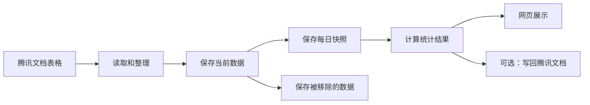
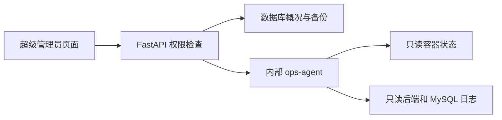

# 系统是怎么工作的

## 先说人话

这个系统目前有两种数据入口：

- 腾讯文档核查表格：同步后保存快照、归档和日报。
- 管理员上传的走访明细和星级评定 XLSX：校验、关联后保存，并按日期生成走访汇总。

腾讯文档这条数据流程主要做六件事：

1. 从腾讯文档读取表格。
2. 整理数据，并去掉重复项。
3. 保存当前数据。
4. 保存每日快照和被移除的数据。
5. 计算每天或一段时间内的统计结果。
6. 在网页上展示，也可以把汇总结果写回腾讯文档。



## 三个数据库分别放什么

| 数据库 | 通俗解释 |
|---|---|
| `OnlineData` | 当前正在使用的数据，以及用户、配置和同步记录 |
| `OnlineDataArchive` | 已经从腾讯文档移除的数据，留作历史查询 |
| `daily_report` | 每日快照、每日统计和总汇总 |

走访和星级评定数据保存在 `OnlineData`，不写入另外两个数据库：

| 表 | 用途 |
|---|---|
| `_visit_import_batches` | 保存每次导入的文件摘要、日期范围和处理数量 |
| `t_visit_details` | 唯一的走访业务表，同时保存走访明细和已经关联的星级评定字段 |
| `_visit_import_issues` | 保存本次导入的错误和提醒，页面读取时会再次遮盖敏感信息 |
| `_community_aliases` | 保存社区正式名称与来源数据别名的对应关系 |

源码中还会看到四个数仓缩写：

- ODS：当前原始数据，主要在 `OnlineData`。
- DWD：每天保存一份数据快照。
- 任务流水：逐条记录任务当天是结转、当天活动还是移除，用于日报和区间去重。
- DWS：按核查人或社区整理出的每日报表。
- ADS：给页面展示的总汇总。

最重要的规则：查询多天数据时，要从内部任务流水重新计算，不能直接把每天的报表相加，否则同一条数据可能被重复计算。

数据库初始化由两个地方共同负责：

- `backend/init.sql`：新数据库第一次启动时建表。
- `backend/database.py`：后端启动时补充必要的表和兼容处理。

改数据库结构时，这两个地方都要检查。

## 部门、权限组和登录会话

从 `0.9.0` 开始，人员不再直接把“所属社区”当作组织关系，而是关联“所属部门”：

- 社区部门与社区资料一一对应；新增、改名和删除社区时，部门同步变化。
- 片长、中队长和基础管控固定属于“内勤”。
- 组长和组员必须选择一个社区部门。
- 自购房岗位可以暂不选择部门；没有社区范围时不能查看业务数据。
- `_grid_members.community` 暂时保留给旧版本，统计和权限判断以 `_departments` 为准。

权限采用“岗位默认权限组＋单个账号覆盖”：

| 预设权限组 | 默认岗位 | 默认数据范围 |
|---|---|---|
| 流口岗 | 组长、组员、自购房 | 所属社区 |
| 全局查看组 | 片长 | 全部社区，只读 |
| 内勤业务组 | 中队长、基础管控 | 全部社区，可执行日常业务操作 |
| 管理员 | 由超级管理员单独指定 | 全部社区，可维护人员和社区 |
| 超级管理员 | 超管账号 | 全部功能 |

超级管理员可以调整前四个预设组的权限，也可以创建自定义组；超级管理员组固定不可修改。
账号默认继承关联人员的岗位权限，岗位变化后自动更新；选择“单独指定”后不再随岗位变化。
权限组、岗位映射和变更记录分别保存在 `_permission_groups`、
`_position_permission_groups` 和 `_permission_change_log`。

后端是权限判断的最终入口：

- 每个写操作检查具体功能权限，不能只依赖网页隐藏按钮。
- “所属社区”数据范围按业务记录的社区过滤，不按账号关联人员的姓名过滤。
- 正式社区和它的别名先统一后再判断范围。
- 汇总表过滤后重新计算总计；没有社区部门的流口岗返回空数据和明确说明。
- 人员姓名、部门、岗位和在岗状态对所有账号可见；电话、身份证状态、备注、请假原因和完整出勤记录需要敏感资料或出勤管理权限。

同一账号只保留一个有效会话。登录成功时会把 `_users.active_session_id` 换成新会话编号，
另一台设备的旧会话在下一次请求时返回 `session_replaced`。同一浏览器的多个标签页共享 Cookie，
所以不会互相顶掉。

会话同时受两种时间限制：

- 连续无有效操作默认 30 分钟退出，超级管理员可设置 5 分钟至 24 小时。
- 无论是否持续操作，登录满 24 小时都要重新登录。

只有页面跳转、主动查询、保存、上传、同步、生成、删除以及点击“继续使用”会更新
`_sessions.last_activity_at`。键盘输入、滚动、鼠标移动、自动保存和后台轮询不更新。到期前
2 分钟前端显示倒计时；另一设备登录、空闲退出和绝对到期分别返回明确原因。

## 走访明细怎么导入

“走访汇总”支持分别上传走访明细和星级评定 XLSX。两份来源文件不会分别保存成两张业务表：
走访明细先写入 `t_visit_details`，星级评定匹配成功后直接补充在同一条走访记录上。

管理员上传文件后，浏览器只负责传文件，后端负责解析和入库：

1. 文件必须是 `.xlsx`，不超过 20MB。
2. 整个工作簿必须恰好有一个工作表包含完整的 11 个标准表头。
3. 地址、操作人和入户时间等关键字段错误时，该行跳过；其他正确行继续处理。
4. 社区名称按来源中的完整文字匹配，只清理首尾空格并统一字符形态，不自动删除末尾的“社区”或“村”。系统先匹配正式名称，再匹配社区管理中配置的别名；匹配成功后保存正式名称，原始“村社区”字段保持不变。例如正式名称是“南厍”时，应把来源中的“南厍村”配置为别名。
5. 空白的房间核查数量、新增、变更和注销按 0 处理，填写的值必须是非负整数。

人员可以跨社区走访，因此操作人的社区部门和本次走访社区不同不算异常，也不会产生提醒。

去重使用“本地业务日期 + 标准化地址 + 网格员姓名”：

- 同一天、同一地址、同一网格员只保留一条，以入户时间更晚的记录为准。
- 同一天同一地址由不同网格员分别走访时，每名网格员各保留一条。
- 入户时间相同但内容不同，以最后上传的数据修正原记录。
- 较早记录会忽略，完全相同的记录记为“重复未变”。
- 相同地址出现在不同日期时，算作新的走访。
- 新文件与旧库日期重叠时只合并和更新，不删除文件中没有出现的旧记录。
- 文件内容还会计算 SHA-256；完全相同的文件再次上传时不会重新处理。

同一时间只允许一个走访文件入库，避免两个管理员同时上传时互相覆盖。服务意外重启后，
遗留的“导入中”批次会标记为失败，管理员可以重新上传原文件。

星级评定使用“标准化地址 + 时间”关联：

- 地址必须与走访明细标准化后的地址相同。
- 星级采集时间和入户时间相差不能超过前后 24 小时。
- 同一地址有多次走访时，选择时间差最小的一次。
- 如果两条走访的时间差完全相同，系统不会猜测属于哪位网格员，而是给出“匹配有歧义”提醒。
- 星级评定一定依附于走访；无法匹配的评定不会生成独立业务记录。
- 页面分别显示走访总数、已星级评定数和“仅走访未评定”数。

入户时间按系统时区理解，数据库保存 UTC 时间，并另外保存本地业务日期。页面的“当前数据库数据范围”
来自业务日期，显示最早和最晚日期、记录数、有数据日期、无数据日期以及最近一次成功导入时间。

## 工作日志怎么生成

“数据工作台 → 工作日志生成”把系统统计和管理员填写的内容合并为固定版式 PDF。当前只支持日报：

- `OnlineData._work_log_drafts` 按“日志类型＋业务日期”唯一保存草稿。
- 页面按照原工作日志顺序展示十个章节和十六张表格。概览句中的空缺直接使用输入框，表格在网页中完成编辑。
- 创建草稿时读取一次所选日期的在线数据总汇总表、出租房走访社区汇总和自购房走访人员汇总，并把三类数据保存为系统快照。以后底层统计变化不会悄悄改变草稿；只有当前编辑人点击“刷新系统数据”才重新读取。
- 三张带“网格员数”的表统一按业务日期计算：读取在线汇总配置岗位，按人员的社区部门统计当天在岗人数，请假人员排除，周末按双休日备勤安排判断。周末排班不完整时保持空白，不猜人数。流动人口登记注销表仍允许人工修改；刷新系统数据只补齐空白人数，不覆盖人工值。
- 系统字段允许人工覆盖，并可以恢复成系统快照值。刷新时保留人工填写和覆盖值。
- 修改自动表格后，概览合计重新计算；单独覆盖概览字段后以人工值为准。
- 创建者默认拥有编辑权，其他管理员只能查看和导出；主动接管会改变负责人、提升草稿版本并写入操作记录。
- 管理员和超级管理员可以在独立的“工作日志草稿”页面查看全部草稿，按日期或人员查找，并打开继续填写。删除只移除 `_work_log_drafts` 中的草稿，不会删除在线数据、走访数据或日报统计；删除后同一天可以重新创建，删除动作会写入操作记录。
- 自动保存带版本号。两个页面基于同一旧版本保存时，后一次返回 `409`，不能静默覆盖较新的内容。
- 指令核查固定使用两列口径：三列中的“已完成”作为工作日志的“已核查”，其余两种未完成状态合并为“未核查”。这与账号个性化显示方式无关。
- 所选日期没有对应日报或没有任何走访数据时，系统字段保持空白并说明来源不可用，不能用 0 伪装成已确认的统计结果。

日报使用后端固定的 HTML/CSS 打印版式生成 A4 PDF，生成后直接返回，不在服务器保存文件。打印版式参照原工作日志的公文样式：红色标题、红色分隔线、岗位与日期栏、仿宋正文、红色问题分析和紧凑表格；平台不分发原文件使用的商业字体，服务器使用已安装的中文字体作相近替代。正文日期和取数日期均为所选业务日期，落款使用下一自然日。旧 Word 样例只用于本机核对结构，不能提交，其中的正文、嵌入表格、预览图、链接和文档属性都不能进入生成模板。

走访汇总直接查询 `t_visit_details`，不另外生成日报表：

- 页面可以选择“出租房”或“自购房”两类。出租房使用系统设置中配置的岗位，默认组长、组员；
  自购房固定使用人员管理中的“自购房”岗位。
- 人员管理中没有登记的姓名暂时放在出租房中，避免真实数据被隐藏；因为无法判断岗位，
  不会同时放进自购房，确保两类数据不重复。
- 日期区间按走访记录的“业务日期”筛选，开始日期和结束日期都包含在内。
- 网格员汇总按“实际走访社区 + 操作人”分组，所以同一人跨社区走访时会分别显示。
- 社区汇总按实际走访社区分组，两张表的总计必须一致。
- 走访户数是一条去重后的走访记录算一户。
- 总变动数等于新增、变更和注销之和。
- 户均变动数等于总变动数除以走访户数，使用四舍五入保留 1 位小数。
- 社区表使用“在岗人日”作为人均指标的分母。每天实际在岗 1 人记 1 个人日；临时请假、
  长期离岗和周末休息不计入。
- 人均日走访户数等于走访户数除以在岗人日；人均日变动数等于总变动数除以在岗人日，
  两项都四舍五入保留 1 位小数。
- 人员当天跨社区走访时，这 1 个人日按各社区当天的走访户数比例分配；当天没有走访时，
  人日归到人员管理中的社区部门。名册外人员只有在真实产生走访的日期才补 1 个人日。
- 排休或请假日期如果实际产生了走访，以真实走访为准计入 1 个人日，并在接口中返回提醒。
- 星级评定数只计算已经成功关联的走访，星级评定率等于星级评定数除以走访户数。
- 表底总计会汇总在岗人日，再重新计算两个人均指标、户均变动数和星级评定率。
- 所选区间包含周末且该周还没有完整排班时，系统不会猜测分母；两个“人均日”指标返回空值，
  页面提示需要补齐哪些周的排班。

“操作人账号”按身份证号处理。姓名能匹配到现有网格员且该人员尚无身份证号时，系统自动补齐；
已有号码不同时不覆盖，只给出提醒。完整号码按已确认方案明文保存，但接口、页面、错误详情、
导出和日志不得返回完整号码。当前隐私风险记录在 [风险清单](known-risks.md)。

## 人员岗位和请假怎么影响统计

“人员管理”可以保存六种岗位：中队长、基础管控、自购房、片长、组长和组员。

超级管理员在“系统设置 → 岗位范围”中分别选择：

- 哪些岗位进入在线数据汇总。
- 哪些岗位进入出租房走访汇总。自购房使用固定的“自购房”岗位，不需要另外配置。
- 哪些岗位需要参加双休日备勤。

在线汇总和出租房走访汇总默认都选择“组长、组员”，也可以分别修改。系统已经认识、但岗位没有被选中的人员，
不会进入对应汇总。业务数据里出现了人员管理中没有的姓名时，系统暂时保留这条真实数据，
避免因为名册没有及时维护而把工作记录直接隐藏。走访数据中的未知姓名只归入出租房，不会
同时出现在自购房中。

请假不再放在编辑人员资料的窗口里。人员列表的“编辑”旁边有独立的“请假”按钮：

- “临时请假”需要选择开始和结束日期，到期后自动恢复正常。
- “长期”没有结束日期，需要在人员恢复工作时手动点击“恢复正常”。
- 每次设置都会写入 `_personnel_attendance_history`，过去记录不再被下一次请假覆盖。
- 补录已经结束的过去请假，只增加历史记录，不会改变人员当前状态。

数据库内部仍保留 `status`、`leave_start_date` 和 `leave_end_date` 等旧字段，目的是让旧版本可以
安全回退。普通页面不再要求管理人理解“在岗”和“长期离岗”两套状态。

被配置为需要备勤的岗位使用双休日备勤，默认是组长和组员：

- 每周可以选择周六或周日一天在岗；两天都不安排时表示双休日都休息。
- 排班保存在 `_personnel_weekend_duty`，按周保留历史，不会被下周覆盖。
- 保存时必须提交当周全部备勤人员。`duty_date` 为周六或周日表示当天在岗，为空表示两天都休息；有空日期记录与完全没有该人员记录含义不同。
- 请假优先于周末排班；两天都请假时自动免排，只请假一天时只能选择另一天。
- 电脑端可以拖动整张人员卡片，也可以批量安排或移回待安排区；手机端不使用拖动，直接点“周六”“周日”或“双休”。
- 工作日默认在岗，周末只有排到的日期算在岗。历史排班缺失时，走访汇总不会显示人均日指标。

在线数据的核查人明细以“人员管理”中的已选岗位名单为基准。指定日期没有任何统计数据的正常
人员也会显示一行全 0；长期或当天临时请假的人员不补零。单日报表按日报日期判断，区间报表按
结束日期判断。旧日报在读取时使用当前人员名单和当前岗位配置重新整理，所以人员岗位或统计
岗位配置变化后，旧日报的展示也会跟着变化。

社区汇总直接按逐任务流水统计。任务即使尚未填写核查人，也会计入所属社区；核查人明细不会
生成空姓名行。单日查询读取已经生成的社区日报，区间查询直接从区间任务流水去重后按社区
统计。社区没有任务但有应统计人员时，仍保留一行全 0。

社区管理中的别名同时用于走访数据和在线数据汇总。在线表格及每日快照保留来源中的原文字，
任务流水和新生成的日报会转换为正式社区；读取已经生成的旧日报或旧流水时，也会按当前别名
配置动态归并。因此把“南厍村”设为“南厍”的别名后，单日分表、区间分表和总汇总都会显示
“南厍”，不会另外保留一行“南厍村”。以后修改别名时，历史汇总的社区归属也会随之变化。

社区表还可以保存多位社区民警，数据库以姓名列表保存。创建工作日志草稿时，指令核查、出租房
走访以及其他按社区预建的人工表格会自动带入对应姓名；多位民警使用“、”连接。社区民警属于
草稿创建时的系统快照，后续修改社区资料不会悄悄改变已经存在的工作日志草稿。

`_grid_members` 仍只显示当前或最近一次请假，完整记录以出勤历史表为准。外部请假系统对接、
审批状态和外部单号见 [未来计划](future-plans.md)。

## 日报日期必须有快照

日报只能使用对应日期的同步快照：

- 查询日期没有快照时，页面显示暂无数据。
- 生成某一天的日报时，如果当天没有快照，系统会拒绝生成。
- 不能拿当前在线数据代替过去日期的数据。

系统按“系统设置”里的时区判断今天，默认使用上海时区。数据库时间仍按 UTC
保存，统计时会自动换算日期范围。这样在北京时间凌晨同步，也不会被记到前一天。

## 两个汇总页的数据概览怎么算

“在线数据汇总”的概览跟随当前选择的业务类型和日期区间，不是一组固定数字：

- 任务总数与区间汇总使用同一套任务流水去重和岗位筛选规则。
- 结转数据是任务第一次进入所选区间时，已经从更早日期结转过来的未完成任务。
- 新下发数据是任务第一次进入区间时，前一张可用快照中还不存在的任务。
- 已有任务变化是前一张快照中已经存在，但地址或核查结果发生有效业务变化的任务。
- 结转、新下发和已有任务变化三项互不重复，相加必须等于任务总数。
- 待完成与已完成相加也必须等于任务总数。
- 查看“总汇总表”时，只合并系统设置中已经选中的分汇总业务类型。

概览中的可用日期范围来自 `_daily_task_ledger_runs`，表示已经生成任务流水的日期，
不能拿没有同步快照的日期补造数据。

“走访汇总”有两层概览：

- 页面上方显示整个走访数据库的起止日期、记录数、星级关联情况和无数据日期。
- 查询区域显示当前“出租房或自购房＋日期区间”的走访户数、参与人员、总变动数、
  星级评定数、仅走访未评定数和涉及社区数。

当前走访概览直接使用同一次汇总的筛选结果，数字与人员表、社区表和表底总计保持一致。

## 统计数字和天数是什么关系

单日和多日现在使用同一套“逐任务流水”，但聚合方式不同：

- 查一天时，显示当天应处理的任务：前期未完成且仍在线的结转任务，加上当天新增或地址、核查结果发生变化的任务。
- 查多天时，同一业务、同一任务只保留区间内最后一条流水，并按区间结束时的状态统计。

每天第一次成功同步后，系统会用最近一张更早的可用快照与当天快照对比。前一张快照中仍未
完成、并且当天还在线的任务，会结转到当天；当天新增、未完成任务的地址变化，或核查结果业务
类别变化的任务，也会进入当天。结转任务当天又发生变化时，仍只算一条，内部标记为“结转”。
已经完成且没有变化的旧任务不会每天反复进入日报。

任务第一次完成时，以完成当天快照中的核查人和社区作为当日归属。已经完成的任务后来只是补充
地址文字，或在同一种核查结果中补充备注，不再算作新的工作量，也不会改变原完成日的归属。
任务重新变成未完成状态，或者核查结果从一种业务类别变为另一种类别时，才重新进入当天日报。

地址和结果都未填写是“未核查”，只填写地址是“已核查”，填写了核查结果就是“已完成”。
进入当天日报后，统一按当天最终状态归类；未核查、已核查、已完成三列之和必须等于数据总数。
结转任务当天完成时会归入当天“已完成”，次日不再结转。

未完成任务如果已经从腾讯文档移除，当天会留下内部“移除”记录，但不会再进入日报或后续区间
统计。已经完成后才移除的任务仍保留其完成结果。人员或社区调整时，使用当天快照中的最新人员和
社区。中间某天没有快照时，不补造日报；下一次有快照时使用最近一张更早的可用快照作为结转依据。

内部表 `_daily_task_ledger` 以“日报日期、业务类型、任务 `_row_key`”唯一保存来源、是否纳入、
是否仍在线、最终状态、社区、核查人及见底信息；`_daily_task_ledger_runs` 记录该日期的回算或同步
是否已经完成。它们不是公共接口的一部分，网页继续使用原有日报字段和列名。

“无法见底数”只统计核查结果为“无法核实”的数据，不能把还未核查的数据算进去。
“见底数”继续按照各业务原有的核查结果规则计算；“核查见底率”按“见底数 ÷ 已完成”计算。
没有已完成数据时，核查见底率为 0。未核查和只填写了现住址的数据不进入这个比例的分母，
因为这个指标只比较已经给出最终核查结果的数据。两列模式中的“已核查”就是三列模式的
“已完成”，所以两种显示模式使用同一口径。总汇总表没有单独保存见底数，仍按
“已完成 − 无法见底数”得到合计见底数。

“疑似未注销模型三”没有“现住址”这一中间字段，所以使用单独规则：核查结果为空是
“未核查”，“近期反吴”“在吴”“离吴”任意一种都是“已完成”，“已核查”固定为 0。
这三种结果都表示已经见底，社区使用原表中的“下发社区”。模型三没有“无法核实”这个结果，
所以它的无法见底数固定为 0。

汇总表有两种显示方式，但数据库和日报始终保存完整的三列结果：

- 三列模式：显示“未核查、已核查、已完成”。
- 两列模式：把原来的“未核查”和“已核查”相加后显示为“未核查”，把原来的“已完成”
  显示为“已核查”。

两列模式只改变网页和导出时的展示，不会改写日报或历史数据。“核查完成率”等于两列模式中的
“已核查 ÷ 数据总数”，所以数值与三列模式的“已完成 ÷ 数据总数”相同。转换逻辑统一放在
后端，网页和以后增加的 XLSX 导出都要调用同一套规则，不能各自计算一遍。

页面不再让用户选择“表格/卡片模式”。电脑端固定使用表格，手机端由页面自动使用卡片或
精简列表；在线汇总在手机端仍可临时切换到完整表格。旧的 `table_display_mode` 字段和接口
参数暂时保留，只用于兼容旧版本，不再影响新版页面。两列/三列模式仍保存在当前用户账号中，
同一账号换电脑登录后会保持一致。

每张核查人明细、社区汇总和总汇总的底部都有一行“总计”。数量字段直接相加；
核查完成率、核查见底率和当日人均核查数使用合计后的数量重新计算，不能把每行的百分比或
人均值直接相加。后端返回整次查询的总计；网页使用表头筛选后，会根据当前仍显示的行实时
重算总计和标题行数。以后导出筛选后的 XLSX 时，也必须对实际导出的行重新计算，不能继续
使用未筛选的整表总计。

总汇总也同时返回“网格员明细”和“社区汇总”。网格员明细会把配置中的各张分汇总表按姓名
合并，同一人在不同业务中只显示一行，各项数量相加后重新计算比例；人员管理中当天应统计但
所有业务都是零的人仍会显示。已登记人员以当前名册中的姓名和社区为准，名册外但确有业务
数据的人不会被隐藏。社区汇总使用各分表的社区统计结果，所以尚未填写核查人的任务也会计入
所属社区；这类任务因为暂时无法归到个人，社区总数可能会高于网格员明细总数。

一次同步会先读完全部已启用表格，并保存本轮成功业务的最新快照。数据阶段结束后，系统再逐张
生成本轮成功且支持日报的分汇总表。只有数据和分汇总表全部成功时，才最后更新总汇总表。
如果其中一张表失败，已经成功的分汇总表会保留，但总汇总表不会被新结果覆盖，避免出现缺少
部分业务数据的总表。

在页面上手动生成总汇总表时，系统会按照“总汇总表配置”中选中的业务类型，先逐张重新
生成对应日期的分汇总表，再生成总汇总表。如果其中一张分表没有当天快照或生成失败，
本次总汇总会停止，并提示具体是哪一种业务，避免生成一个缺少部分业务数据的总表。

目前页面显示的区间天数只用于提示，没有拿来做除法。这个天数是“找到快照的天数”，
不一定等于开始日期到结束日期之间的自然天数。例如选择 7 天但只有 5 天同步过，页面
记录的天数就是 5。

区间开始以前就遗留、但在开始日仍未完成的任务，会因为开始日的结转流水纳入区间；连续结转多天
的同一任务仍只计算一次。区间结束前最后被移除且仍未完成的任务会排除；在区间内完成后才移除的
任务仍按已完成保留。

| 指标 | 当前算法 | 是否除以天数 |
|---|---|---:|
| 数据总数、未核查、已核查、已完成、无法见底数 | 区间任务流水去重后的数量 | 否 |
| 核查完成率 | 已完成 ÷ 数据总数 | 否 |
| 核查见底率 | 见底数 ÷ 已完成；没有已完成数据时为 0 | 否 |
| 网格员人数 | 按区间结束日期计算在岗人数 | 否 |
| 当日人均核查数 | 已完成 ÷ 在岗网格员人数 | 否 |

所以“当日人均核查数”只在查一天时名副其实。查询多天时，它目前实际表示“这段时间每名在岗网格员完成多少条”，没有再除以天数。

如果区间内每天在岗人数都相同，可以用下面的简化算法计算“日均人均核查数”：

```text
已完成 ÷ 在岗网格员人数 ÷ 区间天数
```

如果区间内有人请假、离岗或恢复在岗，更准确的算法是：

```text
已完成 ÷ 在岗人天
```

“在岗人天”就是把每天实际在岗的人数相加。例如第一天 10 人、第二天 9 人，
两天合计就是 19 个在岗人天。当前系统没有保存完整的历史人员名册，只保存现有人员
和一个请假区间，因此还不能保证所有历史日期都能准确还原在岗人天。

是否替换原指标，还是同时保留“区间人均”和“日均人均”，需要由项目管理人确认后再改。届时还要
决定除以日期范围的自然天数，还是实际有同步快照的天数。

## 目前支持哪些业务表

| 业务类型 | 保存到哪里 | 能读取 | 能生成日报 |
|---|---|---:|---:|
| 全链条 | `t_fullchain` | 是 | 是 |
| 出租房屋核查 | `t_rental_check` | 是 | 是 |
| 涉警统计 | `t_police_stats` | 是 | 否 |
| 疑似未注销模型三 | `t_suspect_unrevoked` | 是 | 是 |
| 疑似返苏 | `t_suspect_return` | 是 | 是 |
| 寄递业 | `t_delivery_industry` | 是 | 是 |
| 群租房核查 | `t_group_rental` | 是 | 否 |

代码中的最终依据：

- 支持读取哪些表：`backend/services/parsers/__init__.py`。
- 支持生成哪些日报：`backend/services/report_builders/__init__.py`。

增加一种业务表时，不能只增加一个页面，还要一起检查数据库表、解析器、归档、查询、日报和前端选项。

疑似返苏在代码和新建数据库中使用“身份证号码”“二次核查结果”作为标准列名。旧部署的归档表
可能仍使用“身份证号”“二次反馈”，同步和查询会自动识别这组旧列名。旧归档表的“联系号码”
还需要按受控迁移文件扩到 500 个字符；迁移必须在三库备份后单独执行。

## 入库主键和重复数据

- 全链条使用“身份证号 + 电话号码 + 下发日期”识别一条记录。同一人员在不同下发批次中会分别保存。
- 涉警统计使用“序号 + 日期 + 社区 + 简要警情及处理结果”识别一条记录。生产环境目前关闭了
  涉警统计同步；重新启用前仍建议在腾讯文档增加永久不变的记录编号。
- 除出租房屋核查外，只有所有业务字段都完全相同的行才会自动去重。主键相同但内容不同时，
  该业务表会停止同步并明确报错，不再用最后一行静默覆盖前面的数据。
- 出租房屋核查按“身份证号 + 手机号码”识别核查对象。同一对象在在线表格中出现多行时只计
  一次，并按表格顺序合并非空内容；后行的非空内容优先，后行空白不会擦除前行已填写的核查
  结果。身份证号和手机号都为空时不能判断是否同一人，仍按冲突停止同步。
- 旧主键切换到新主键时，使用 `backend/migrations/rekey_collision_tables.py` 先演练再迁移。
  迁移只补当前在线数据，不改写历史日报。

## 后端主要文件

| 文件或目录 | 作用 |
|---|---|
| `backend/main.py` | 启动 FastAPI，并注册真正可用的接口 |
| `backend/services/sync_engine.py` | 负责完整的数据同步流程 |
| `backend/services/sync_tasks.py` | 创建手动或自动同步任务，重排下次执行时间 |
| `backend/services/sync_scheduler.py` | 每隔几秒检查一次是否到达自动同步时间 |
| `backend/services/txdocs_client.py` | 负责读取和写入腾讯文档 |
| `backend/services/report_builders/` | 负责生成单日报表 |
| `backend/services/report_ledger.py` | 记录跨日结转、移除和当天活动，并聚合日报 |
| `backend/services/report_range.py` | 负责计算一段时间的统计 |
| `backend/migrations/backfill_daily_task_ledger.py` | 审计并安全回算历史任务流水和日报 |
| `backend/services/report_view.py` | 统一转换汇总表的两列或三列输出 |
| `backend/services/permissions.py` | 定义权限目录、预设组、岗位默认组和数据范围 |
| `backend/services/data_scope.py` | 按账号社区范围过滤业务数据和汇总结果 |
| `backend/services/mobile_navigation.py` | 校验账号的手机 Dock 分类、页面顺序和功能权限 |
| `backend/tools/import_users.py` | 预览或执行一次性私密账号名单导入 |
| `backend/services/visit_import.py` | 校验、去重并导入走访明细，计算已有数据范围 |
| `backend/services/star_rating_import.py` | 校验星级评定并在 24 小时内关联走访记录 |
| `backend/services/visit_summary.py` | 按日期区间计算网格员和社区走访汇总 |
| `backend/routers/visits.py` | 提供走访范围、导入和问题明细接口 |

后端目前包括登录、表格配置、同步、统计、数据查询、走访明细导入、网格员、系统设置、用户管理、站内通知和健康检查。

## 超级管理员运维中心

运维中心只给超级管理员使用。它用于看状态和创建备份，不是网页终端。

它分成两部分：

- 主后端负责权限、数据库概况、备份、审计和页面接口。
- `ops-agent` 只负责读取 Docker 中两个白名单容器的状态和日志。只有这个内部容器可以访问 Docker Socket，它没有公网端口，也没有执行命令、重启或删除接口。



运维数据保存在 `OnlineData`：

| 表 | 用途 |
|---|---|
| `_backup_schedule` | 保存每日备份时间，默认按系统时区凌晨 2 点执行 |
| `_backup_jobs` | 保存备份任务状态、文件名、大小、SHA-256 和错误信息 |
| `_admin_audit_log` | 保存超管重要操作，不保存密码、令牌、Cookie 或请求正文 |

备份使用 MySQL 客户端直接导出三个数据库，不通过 Docker Socket。流程是：

1. 先写临时 SQL 文件。
2. 压缩成临时 gzip 文件。
3. 检查命令结果、文件大小、gzip 能否完整读取和必要的数据库标记。
4. 计算最终 gzip 文件的 SHA-256。
5. 全部通过后，才改成正式文件名。

平台创建的自动和手动备份都保存 7 天，并始终保留最近一份成功备份。旧版本留下的备份只展示，不自动清理。恢复和删除都不在网页中提供。

## 定时同步和同步状态

定时同步默认开启，初始间隔是 5 分钟。系统没有引入额外的定时任务组件，而是在后端进程中每隔
5 秒检查一次数据库里的下次执行时间。真正创建任务前会使用数据库锁，因此同一时刻只会有一个
等待中或运行中的同步任务。

相关数据保存在 `OnlineData`：

| 表 | 用途 |
|---|---|
| `_sync_schedule` | 保存是否开启、间隔、下次执行时间和最后触发时间；固定只有一行 |
| `_sync_log` | 保存手动或自动来源、当前阶段、当前业务、真实步骤和错误信息 |
| `_notifications` | 按账号保存个人提示；当前主要是发给超级管理员的自动同步和备份失败提示 |
| `_announcements` | 全站公告只保存一份，所有登录用户都能查看 |
| `_announcement_reads` | 按账号保存每条公告的已读状态，互不影响 |

手动同步和自动同步使用同一套数据与报表流程。任务无论成功、部分失败还是失败，都会从结束时刻
重新等待一个完整间隔。后端重启时，遗留的等待中或运行中任务会被标记为失败；如果它原本是自动
任务，还会向每名超级管理员各写入一条个人提示。

消息中心向所有登录用户开放，并分为“公告”和“个人提示”。公告不会复制给每个账号；系统只在
`_announcements` 保存一份内容，再通过 `_announcement_reads` 判断当前账号是否已经阅读。
超级管理员可以发布或删除公告，操作写入管理记录。系统升级时会自动发布“出勤历史数据说明”，
替代走访汇总页面中重复出现的长期提示。

权限规则：

- 超级管理员可以修改定时同步设置，也可以手动同步。
- 管理员可以手动同步，但不能修改定时设置。
- 组长和组员只能查看同步状态与下一次倒计时。
- 所有角色都可以查看公告和属于自己的个人提示；只有超级管理员可以发布或删除公告。
- 自动同步和备份失败仍然只向超级管理员发送个人提示。

`backend/routers/test_mock.py` 虽然存在，但没有在 `backend/main.py` 中启用，所以它现在不是可用接口。这个问题记录在 [风险清单](known-risks.md)。

## 前端主要文件

- 页面入口：`frontend/src/App.tsx`。
- 接口调用：`frontend/src/api/client.ts`。
- 登录状态：`frontend/src/context/`。
- 登录保护：`frontend/src/components/ProtectedRoute.tsx`。
- 统一表格：`frontend/src/components/AppTable.tsx`。电脑端的汇总、原始数据和管理页面使用 Ant Design Table；在线与走访汇总会额外启用浅灰色竖向虚线。
- 手机导航：`frontend/src/components/MobileDock.tsx` 和 `frontend/src/navigation/mobileNavigation.ts`。手机默认显示浮空 Dock，电脑始终显示左侧栏；账号可以改回手机侧边栏，也可以调整 Dock 分类和页面顺序。
- 外观主题：账号可以选择浅色、深色或跟随系统。后端把选择保存在 `_users.theme_mode`，前端统一由主题容器切换 Ant Design 和平台自有样式；旧账号默认保持浅色。
- 响应式显示：在线汇总手机端使用精简列表，并保留临时查看完整表格的入口；走访汇总、社区管理和用户管理手机端使用卡片。页面不再读取旧的表格/卡片偏好。
- 走访汇总页面：`frontend/src/pages/VisitSummary.tsx`。按日期查看网格员和社区汇总，并列上传走访明细和星级评定，显示数据范围、上传结果和导入问题。

前端构建结果放在 `frontend/dist/`，这个目录不会上传 Git。修改前端后要重新运行：

```powershell
Set-Location frontend
npm.cmd run build
```

## 当前生产环境要注意什么

生产服务器已在 2026-07-28 完成安全入口和运维中心上线：

- MySQL 不发布宿主机端口，只允许 Compose 内部服务访问。
- 后端只绑定宿主机回环地址，由 nginx 对外提供 HTTPS。
- 浏览器会话 Cookie 在生产环境启用 `Secure`，CORS 只接受明确配置的来源。
- `ops-agent` 只在 Compose 内部提供服务，没有公网端口。
- 新数据库不再使用写死的超级管理员密码。现有生产环境不设置初始化账号或密码。

当前服务器的 HTTP 80 还属于另一套独立应用，滨湖平台使用 HTTPS 443。页面和静态资源
也通过本机后端代理，nginx 不需要读取 `/root` 下的文件。

OAuth 凭据加密和异地备份仍未完成，具体见 [风险清单](known-risks.md)。

_源码核对：2026-07-31_
