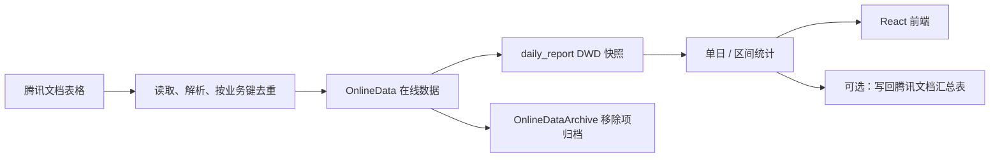

# 滨湖智慧平台架构说明

本文描述当前仓库中可由源码验证的稳定架构。运行中的生产状态与待整改差异见 [风险登记](known-risks.md)。

## 系统数据流

后端使用 FastAPI 与 aiomysql，前端使用 React 18、Ant Design 6、Tailwind CSS 4 和 Vite 6。Docker Compose 定义 MySQL 与后端服务；生产入口配置仍有开放风险，不能从旧部署计划推断实际链路。

## 数据库与数仓层次

| 数据库 | 层次与职责 |
|---|---|
| `OnlineData` | ODS 在线业务表、表格配置、OAuth 配置、同步日志、用户、会话、网格员、社区和系统配置 |
| `OnlineDataArchive` | 被在线源移除数据的归档副本，可保留同一业务键的多次归档记录 |
| `daily_report` | DWD 日快照、DWS 按核查人/社区日报、ADS 总汇总与 `_daily_report_meta` 元数据 |

同步会先比较在线源与当前在线表的新增、修改和移除项。支持日报的类型在归档前保存快照；移除项随后写入归档库。区间统计必须从 DWD 快照合并、按业务键取最新版本，不能直接累加多日 DWS/ADS 结果。

数据库初始化入口是 `backend/init.sql` 与 `backend/database.py`。前者只在新 MySQL 数据目录首次启动时自动执行，后者还包含运行时兼容建表与迁移逻辑。修改任一处时必须检查二者是否继续一致。

## 解析器与日报能力

解析器注册以 `backend/services/parsers/__init__.py` 为唯一事实来源；日报注册以 `backend/services/report_builders/__init__.py` 为准。

| 业务类型 | 在线表 | 解析 | 日报/区间统计 |
|---|---|---:|---:|
| 全链条 | `t_fullchain` | 是 | 是 |
| 出租房屋核查 | `t_rental_check` | 是 | 是 |
| 涉警统计 | `t_police_stats` | 是 | 否 |
| 疑似未注销模型三 | `t_suspect_unrevoked` | 是 | 否 |
| 疑似返苏 | `t_suspect_return` | 是 | 是 |
| 寄递业 | `t_delivery_industry` | 是 | 是 |
| 群租房核查 | `t_group_rental` | 是 | 否 |

`parser_type` 的当前外部值是中文业务名称，不是文件名中的英文后缀。新增业务类型时必须同时评估解析器、初始化表、归档表、查询 API、前端选择项、日报注册和汇总配置。

## 后端边界

- 应用入口与实际路由注册：`backend/main.py`。
- 同步编排：`backend/services/sync_engine.py`。
- 腾讯文档读取：`backend/services/txdocs_client.py`，按单元格上限分页。
- 日报与区间统计：`backend/services/report_builders/`、`backend/services/report_range.py`。
- 静态资源：FastAPI 可以托管构建后的前端并提供 SPA fallback；仓库还保留独立 nginx 配置，当前两种入口尚未统一。

当前已注册的路由族为：`/api/auth`、`/api/spreadsheets`、`/api/sync`、`/api/stats`、`/api/query`、`/api/grid-members`、`/api/system`、`/api/users` 和 `/api/health`。具体方法和请求结构以 FastAPI OpenAPI 与各路由模块为准。

除登录和健康检查外，业务路由需要会话鉴权；用户管理和 OAuth 修改还要求超级管理员。`backend/routers/test_mock.py` 定义了 `/api/test`，但当前没有在应用入口注册，详见风险登记。

## 前端边界

前端路由以 `frontend/src/App.tsx` 为准。认证状态由 `AuthContext` 管理，受保护页面通过 `ProtectedRoute` 进入；用户管理页面要求超级管理员。API 封装主要位于 `frontend/src/api/client.ts`。

前端生产构建输出到 `frontend/dist/`，该目录不进入 Git。任何涉及页面、类型或 API 的改动都至少执行一次生产构建。

_源码核对：2026-07-26_
