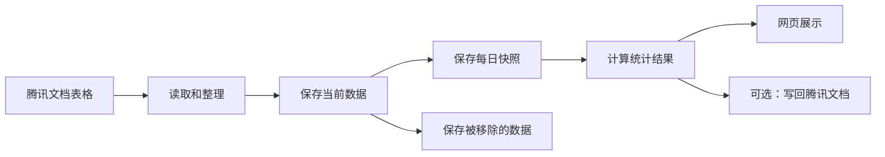
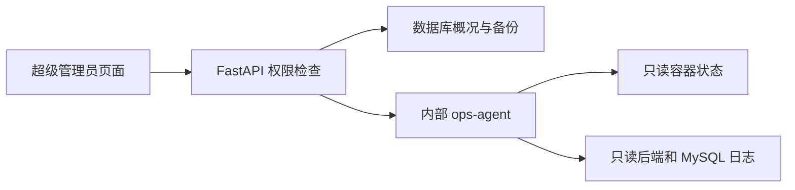

# 系统是怎么工作的

> 当前基线（v0.17.0）：平台仍使用同一个 MySQL 实例和八个业务域数据库；新增应用级预约维护模式，数据库迁移、容器重建等底层维护仍由 Nginx 维护页承接。旧表和迁移备份暂不删除。

## 先说人话

这个系统目前有三种数据入口：

- 腾讯文档核查表格：同步后保存快照、归档和日报。
- 管理员上传的走访明细和星级评定 XLSX：校验、关联后保存，并按日期生成走访汇总。
- 内勤上传的全链条 `.xls/.xlsx`：先形成审核批次，人工确认后再向腾讯全链条表发布。

腾讯文档这条数据流程主要做六件事：

1. 从腾讯文档读取表格。
2. 整理数据，并去掉重复项。
3. 保存当前数据。
4. 保存每日快照和被移除的数据。
5. 计算每天或一段时间内的统计结果。
6. 在网页上展示，也可以把汇总结果写回腾讯文档。



## 八个数据库分别放什么

| 数据库 | 通俗解释 |
|---|---|
| `PlatformData` | 用户、人员、部门、社区、权限、通知、审计、出勤排班和实际工作事件 |
| `OnlineData` | 腾讯配置、同步任务、来源行、来源投影、缓存、在线业务和回写记录 |
| `OnlineDataArchive` | 已经从腾讯文档移除的在线业务，只读保存 |
| `daily_report` | 每日快照、任务流水、日报统计和工作日志草稿 |
| `VisitData` | 走访导入批次、走访明细和导入异常 |
| `DispatchData` | 全链条下发批次、下发任务和发布结果 |
| `RegistryData` | 辖区房屋、地址、房屋相关人员、机构、人员标记和任务标记快照 |
| `WorkflowData` | 工单类型、流程版本、节点、工单、评论、附件元数据和事件流水 |

迁移完成后，走访和下发数据分别保存在 `VisitData`、`DispatchData`；旧表继续保留作为只读回退材料。辖区档案和工单功能分别使用 `RegistryData`、`WorkflowData`；服务器显示时间的授权维护窗口已完成开关切换，旧表和迁移备份继续保留。

| 表 | 用途 |
|---|---|
| `_visit_import_batches` | 保存每次导入的文件摘要、日期范围和处理数量 |
| `t_visit_details` | 唯一的走访业务表，同时保存走访明细和已经关联的星级评定字段 |
| `_visit_import_issues` | 保存本次导入的错误和提醒，页面读取时会再次遮盖敏感信息 |
| `_community_aliases` | 保存社区正式名称与来源数据别名的对应关系 |

源码中还会看到四个数仓缩写：

- ODS：当前原始数据，主要在 `OnlineData`。
- DWD：每天保存一份数据快照。
- 任务流水：逐条记录任务当天是结转、当天活动还是移除，用于日报和区间去重。
- DWS：按核查人或社区整理出的每日报表。
- ADS：给页面展示的总汇总。

最重要的规则：查询多天数据时，要从内部任务流水重新计算，不能直接把每天的报表相加，否则同一条数据可能被重复计算。

数据库初始化由两个地方共同负责：

- `backend/init.sql`：新数据库第一次启动时建表。
- `backend/database.py`：后端启动时补充必要的表和兼容处理。

改数据库结构时，这两个地方都要检查。

## 部门、权限组和登录会话

从 `0.9.0` 开始，人员不再直接把“所属社区”当作组织关系，而是关联“所属部门”：

- 社区部门与社区资料一一对应；新增、改名和删除社区时，部门同步变化。
- 片长、中队长、基础管控和所队领导固定属于“内勤”。
- 组长、组员必须且只能选择一个社区部门；社区民警必须选择至少一个社区部门，并且可以同时属于多个社区。
- 自购房岗位可以暂不选择部门；没有社区范围时不能查看业务数据。
- 人员与部门的完整关系保存在 `_grid_member_department_links`，同一人员、同一部门只有一条；`_grid_members.department_id` 和 `community` 继续同步排序第一项，只用于旧版本回退。
- 人员列表按人员 ID 去重；社区人数会把多社区民警分别计入每个所属社区，全局独立人数仍只计算一次。

权限采用“岗位默认权限组＋单个账号覆盖”，岗位默认和账号覆盖都可以同时选择多个权限组：

| 预设权限组 | 默认岗位 | 默认数据范围 |
|---|---|---|
| 流口岗 | 组长、组员、自购房 | 所属社区 |
| 全局查看组 | 片长 | 全部社区，只读 |
| 内勤业务组 | 中队长、基础管控 | 全部社区，可执行日常业务操作 |
| 管理员 | 社区民警、所队领导，也可由超级管理员单独指定 | 全部社区，可维护人员和社区 |
| 超级管理员 | 超管账号 | 全部功能 |

超级管理员可以调整前四个预设组的权限，也可以创建自定义组；超级管理员组固定不可修改。
账号默认继承关联人员的岗位权限，岗位变化后自动更新；选择“单独指定”后不再随岗位变化。
多个权限组的功能权限取并集，但数据范围按每一项功能权限单独合并：只有本身授予该功能的组
才能把这项功能扩大到全部社区，不能把一个组的功能与另一个组的数据范围交叉组合。
账号同时保存登录用户名和显示姓名。用户名只用于登录且保持唯一；页面优先显示账号的显示姓名，
旧账号姓名为空时依次使用关联人员姓名和用户名兜底。所有登录用户都可以从账号菜单进入个人中心，
查看自己的部门、岗位和权限组，并使用当前密码修改登录密码；显示姓名只能由超级管理员维护。
权限组、岗位多选映射、账号多选映射和变更记录分别保存在 `_permission_groups`、
`_position_permission_group_links`、`_user_permission_group_links` 和 `_permission_change_log`。
旧 `_position_permission_groups` 与 `_users.permission_group_id` 继续同步保存排序后的第一个权限组，
只用于旧版本回退。

业务人员必须恰好关联一个账号。人员管理新增人员时必须选择尚未关联人员的普通账号，或者同时
创建唯一用户名和至少 8 位初始密码的新账号；两步在同一个数据库事务中完成。新账号只能继承该
人员岗位的默认权限，人员管理入口不能指定自定义权限组或创建超级管理员。人员管理允许把人员
改绑到空闲账号；如果目标账号已经关联另一名人员，则在同一个事务中互换双方账号。改绑后账号按
新人员岗位继承权限，受影响的现有会话全部失效。用户管理仍不能解除、改绑或单独删除已关联账号；
只有超级管理员可以在人员管理中联动删除误建的人员、账号、会话和关系记录。系统、公共或超级
管理员账号仍允许不关联人员。

后端是权限判断的最终入口：

- 每个写操作检查具体功能权限，不能只依赖网页隐藏按钮。
- “所属社区”数据范围按业务记录的社区过滤，不按账号关联人员的姓名过滤。
- 社区民警账号的“所属社区”范围是其全部社区部门的集合；每个社区先按别名归一，再与集合比较。
- 正式社区和它的别名先统一后再判断范围。
- 汇总表过滤后重新计算总计；没有社区部门的流口岗返回空数据和明确说明。
- 人员姓名、部门、岗位和在岗状态对所有账号可见；电话、备注、请假原因和完整出勤记录需要敏感资料或出勤管理权限。身份证号及其填写状态只向超级管理员返回，普通管理员不会收到完整号码、遮盖号码或填写状态。

同一账号只保留一个有效会话。登录成功时会把 `_users.active_session_id` 换成新会话编号，
另一台设备的旧会话在下一次请求时返回 `session_replaced`。同一浏览器的多个标签页共享 Cookie，
所以不会互相顶掉。

会话同时受两种时间限制：

- 连续无有效操作默认 30 分钟退出，超级管理员可设置 5 分钟至 24 小时。
- 无论是否持续操作，登录满 24 小时都要重新登录。

只有页面跳转、主动查询、保存、上传、同步、生成、删除以及点击“继续使用”会更新
`_sessions.last_activity_at`。键盘输入、滚动、鼠标移动、自动保存和后台轮询不更新。到期前
2 分钟前端显示倒计时；另一设备登录、空闲退出和绝对到期分别返回明确原因。
Axios 和仍需使用浏览器 `fetch` 的认证请求复用同一个 401 处理入口。后端返回会话被顶替、空闲
超时或绝对到期时，前端统一保存退出原因并跳到登录页；登录密码错误和主动退出明确关闭这项自动
跳转，避免把正常登录失败误判成会话过期。

登录页使用公安业务品牌的响应式双栏布局：桌面左侧叠放蓝色网格底图与透明城市丝绸线稿，展示“数智赋能、守护平安滨湖”；右侧使用透明警徽素材和“滨湖公安智慧平台”名称承载原登录表单。宽度不超过 900px 时隐藏装饰侧栏，保留警徽、平台名称、错误提示和完整登录表单。左侧公安蓝品牌画面保持稳定，右侧背景、登录卡片、文字、输入框、错误提示和浏览器自动填充颜色跟随用户上次保存的深浅色主题切换。

平台原生纵向和横向滚动条统一使用主题变量控制轨道、滑块、悬停和按下状态，Chrome、Edge、Safari 使用 WebKit 滚动条规则，Firefox 使用 `scrollbar-color/scrollbar-width`。Ant Design 虚拟列表和表格底部粘性滚动条使用同一组颜色和圆角；这些样式只改变外观，不改变滚动容器、滚动位置或 Univer 的横向拖动保护逻辑。

## 岗位仪表盘与职责范围

电脑和手机访问 `/` 都先进入岗位仪表盘；原“在线数据汇总”迁到 `/summary`，但继续使用
`online_summary` 导航配置 ID。电脑侧栏固定保留“仪表盘”；手机 Dock 不再单列“首页”，只展示首页
之外最多四个业务分类，顶部“滨湖智慧平台”品牌固定返回 `/`。旧个性化配置继续按权限过滤和补齐业务
分类。`/query` 原有的手机任务分流继续保留，完整流口任务和下发任务工作台仍分别
使用 `/tasks/home`、`/tasks` 与 `/police-tasks`。

`GET /api/dashboard` 先从关联人员派生岗位职责，再与每个模块自己的具体功能权限和数据范围取交集。
组员按本人，组长按本社区，片长按其全部负责片区，社区民警按人员管理中关联社区，基础管控、中队长
和所队领导按全所；无关联管理员和超级管理员使用全所管理视角。社区名先归一为启用社区的正式名称，
停用社区不进入新的职责范围。岗位职责不能代替功能权限，也不能让一个权限组借用另一个权限组的数据范围。

接口始终返回身份、部门、业务日期、最后成功同步、未读消息和近七个自然日的个人贡献；再按权限选择性
附加流口待办、在线核查、走访、下发批次和管理提醒。实时待办读取当前来源投影；今日新下发、结转和完成
读取当日快照，没有当日快照时返回未知值而不是零。页面只显示本人贡献和社区、片区等组织聚合，不提供
实名工作量排名。数字卡跳转到汇总或任务页面时携带 `scope=responsibility` 及合法筛选，目标接口重新派生
职责范围并校验社区，客户端不能通过修改 URL 扩大数据范围。在线汇总、走访汇总、流口任务和下发队列会
把当前筛选同步到 URL，因此刷新后仍保持同一视图。

仪表盘响应按用户 ID 缓存在当前标签页的 `sessionStorage` 中，最多保留 5 分钟。缓存不超过 30 秒时直接
展示而不重复请求；30 秒至 5 分钟时先展示缓存，再静默读取最新数据并替换。手动刷新始终绕过新鲜期，
登录和退出会清除全部仪表盘缓存；写入缓存前还要校验响应中的用户 ID，防止切换账号后串用数据。缓存只
减少重复打开页面的等待，不改变后端权限、职责范围或业务日期判断。

## 公开个人主页与工作贡献

公开个人资料详情继续使用 `/people/{user_id}`，界面只从人员管理中的姓名进入；不再提供独立人员
目录，旧 `/people` 地址重定向到人员管理。资料详情对所有登录用户开放，只返回显示姓名、岗位、
部门、社区和加入平台日期；登录用户名、身份证号、手机号、角色、权限组、具体权限、登录时间和
会话信息不属于公开资料。个人中心继续保留本人账号信息、密码修改和同一份工作贡献日历。

工作贡献保存到兼容表 `_work_activity_events`。有关联人员时使用 `member:{id}` 作为主页键，没有
关联人员的系统账号才使用 `user:{id}`，因此人员改绑账号后贡献仍归到同一人员。事件只保存幂等键、
主页键、人员/账号 ID、工作类型、数量和 UTC 时间，不复制身份证号、手机号、地址、腾讯原始行或
审核正文。页面按系统业务时区归入自然日，使用 GitHub 风格年度热力图显示。

当前计入实际工作的操作固定为：成功写回现住址、核查结果/反馈、实际情况、二次反馈/核查结果、
研判或登记情况；逐条完成下发任务审核，批量审核按真实任务数计；创建工作日志，以及同一人员对
同一草稿在同一业务日内至少一次有效保存。登录、退出、浏览、查询、导出、同步、发布、上传、修改
核查人或社区、人员和系统配置均不计入。后端只在原业务已经成功后记录事件，事件记录失败只写无
敏感内容的警告，不能把已成功的业务请求改成失败。

首次启动会从仍在保留期内的在线回写审计和管理审计幂等回填，旧工作日志缺少创建审计时只补一条
创建贡献。审计已经清理的更早操作无法准确恢复，平台不根据当前业务结果猜测操作者或日期。

## 在线数据查询和腾讯回写

电脑端“在线数据查询”使用开源的 Univer 工作表，提供行列坐标、连续单元格编辑、复制粘贴、
下拉选项、冻结表头和自然空白行。腾讯来源值以 Univer 普通字符串单元格载入，确保日期、身份证号和
长手机号不会被再次解释为数字，也不会在公式栏显示强制字符串的前导单引号；向腾讯回写时仍按来源格
真实物理文本类型提交。腾讯范围读取接口对数值单元格只返回浮点值，不提供原始输入或
小数显示位数，因此 `7.30` 和 `7.3` 到达平台时都只能是 `7.3`；需要保留尾零的来源日期必须在腾讯表格中
保存为文本，平台不会用补零规则猜测。初始化时由前端按当前文本估算内容宽度，再通过 Univer 已验证的
单列宽度接口写入，避免调用 `0.25.x` 在初始化阶段会访问未就绪撤销栈的自动列宽命令。短字段保留
最小宽度，地址、反馈等长字段设有最大宽度。嵌入页面中的工作表会在拖动底部横向滚动条期间同时锁定外层主
滚动区和浏览器文档的纵向位置，并覆盖松开指针后的短暂布局更新，避免实际滚动容器变化或 Univer 聚焦后页面跳回顶部。全屏时由文档根节点进入浏览器全屏，表格卡片再覆盖整个视口，
因此 Univer 挂在页面根节点的筛选、颜色和工具栏浮层仍位于全屏范围内。该页面按路由延迟加载，避免其他页面下载工作表运行库。非流口岗
手机端暂时继续使用原查询卡片和编辑抽屉；组长、组员改用后文的手机任务工作台。归档数据从
`OnlineDataArchive` 读取并永久只读；当前数据在完成
一次新版同步后读取腾讯来源投影：

| 表 | 用途 |
|---|---|
| `_online_source_rows` | 保存来源表、腾讯物理行号、业务主键、完整行哈希、单元格类型、下拉选项和版本 |
| `_online_source_projection` | 按业务主键生成供分页、搜索、筛选和排序的去重父行，并缓存核查人和手机任务状态 |
| `_online_source_cache_state` | 记录每个启用来源表是否已经完成来源定位 |
| `_online_writeback_audit` | 保存 90 天内平台新增、修改和删除的操作者、来源位置及完整前后内容 |
| `_areas`、`_area_leader_links` | 保存片区及可以负责多个片区的片长关系 |

来源定位尚未建立时，当前数据仍使用原业务表查询，但保持只读，等待下一次正常同步。一个业务主键
只有一个腾讯来源行时，可以直接编辑去重父行；存在多行时父行只读，通过选中行操作条打开详情后
分别编辑原始子行。
出租房屋核查继续按既定规则合并父行；其他业务无法合并的重复内容显示冲突，不覆盖业务库。
有整行管理权限的账号可以直接在数据下方的任意空白行输入或粘贴：首次填写后该行转为新增草稿，
后面继续保留空白行。未提交内容只保存在当前页面；业务主键和社区等必填字段完整并在选中行操作条
点击“写入腾讯表格”后，才调用新增接口。已有来源行的授权单元格即时回写；多格粘贴按来源行顺序
逐格写入并传递最新版本，任何一步失败都重新加载来源投影，不能把部分成功伪装成原子成功。

工作表只把蓝色单元格开放编辑。表头、归档、重复父行和后端未授权字段均只读；粘贴范围只要触及
一个只读单元格就整次取消。结构增删、拖动填充、移动单元格及本地撤销被禁用，避免 Univer 本地
状态与已经写入腾讯的数据发生分叉。删除原始行、提交草稿、查看重复来源和冲突状态统一放在选中行
操作条中，不额外占用业务字段列。
界面编辑元数据与腾讯物理写入元数据分开保存。核查人和社区可以在前端显示为选择器，但普通文本格
仍写入姓名或社区文本；只有腾讯返回的真实下拉格才写选项 ID。批量请求和写后回读都按物理类型构造与
比较，避免把前端 `select` 展示类型误传给文本格后触发腾讯校验失败。
后端使用腾讯官方支持的区域更新请求写入最后一条非空记录之后的现有空行，不调用未公开的插行请求；
HTTP 状态、腾讯业务返回码和写后回读三项都成功才返回成功。因此逐格录入不会把半条数据提前写入
腾讯表格，也不会再把 HTTP 200 中的业务失败误判成写入成功。手机端继续使用集中式新增表单。
其他岗位手机端继续使用集中式新增表单；组长、组员的手机任务工作台只处理已有任务，不提供新增或
删除原始行。腾讯会把超出工作表实际总行数的读取范围返回为 `400001 / range invalid`；读取层先从文件元数据取得
目标子表的 `rowTotal`，再把每页结束行限制在这个边界内，不能继续依赖忽略业务码来结束分页。

回写同时检查功能权限和岗位硬限制：

- 组长、组员的查看范围可以由权限组扩大，编辑始终限本人社区，只开放核查人、现住址、核查结果、核查反馈，以及群租房实际情况；主结果含“无法核实”时才开放二次反馈字段。
- 片长查看全所，编辑限其负责片区，可以修改行内全部字段，但不能新增或删除行。修改社区时，修改前后社区都必须属于负责片区。
- 基础管控、中队长、社区民警、所队领导、管理员和超级管理员可以编辑全所；同时拥有整行管理权限时可以新增和真实删除腾讯原始行。
- 自购房、其他岗位和没有关联人员的普通账号默认不能回写。空白或无法按正式名称、别名识别的社区只能由全局编辑岗位处理。

保存单元格时，后端持有工作表级互斥锁，重新读取目标物理行并比较哈希。腾讯内容已经变化时返回
`409`，刷新来源缓存并要求用户重新确认；写入后再次读取，只有值一致才显示成功。新增要求该业务
恰好一个启用来源表、正式社区和全部业务主键字段；如果工作表已经没有可写的现有空行，腾讯会返回
明确错误，平台不得伪造成功。删除保存完整审计快照后真实删除腾讯物理行，再重新定位整张工作表。
同步使用同一把锁，避免平台自己的同步和编辑互相覆盖。

平台回写只更新来源缓存和“待同步”状态，不直接改 `OnlineData` 业务表、归档、每日快照或日报。
下一次正常同步才把“旧任务移除＋新任务新增”等变化纳入既有数据链路。超级管理员可以在系统设置
关闭 `online_writeback_enabled`；关闭后查询和同步不受影响，所有回写接口立即拒绝请求。完整审计
包含身份证号、手机号等原始字段，只能由超级管理员查看，普通管理操作记录只保存来源 ID 和字段名。

### 流口岗任务工作台

组长、组员全端访问 `/` 先进入岗位仪表盘，任务入口保持独立：

- 仪表盘显示姓名、社区、岗位、最近同步时间，以及本人待核查、今日新下发、昨日结转、今日完成和本社区待核查。
- 手机 `/query` 自动转到 `/tasks`；Dock 新增固定 `dashboard` 首页，原 `online_summary` 配置 ID 迁到 `/summary`，`online_query` 继续兼容旧配置并按岗位显示“指令核查”。
- 首批任务固定为全链条、出租房屋核查、寄递业、疑似未注销模型三和疑似返苏。实时待办读取来源投影，今日新下发和结转读取日报任务流水；今天没有快照时显示未知，不用 0 代替。
- 列表默认按关联人员姓名查看“我的任务”，也可切换本社区；任务卡片直接显示来源行中的身份证号和拆分后的手机号，全链条任务额外显示“来源”，地址和处理状态继续保留。详情会把相连或分隔保存的多个电话号码拆成独立选项；多号码直接使用浏览器和手机系统提供的原生选择控件，选中后才拨号或复制，不再叠加网页蒙版。电脑浏览器没有拨号程序时只复制号码，不触发 `tel:`。腾讯为空白结果单元格只返回空选项时，后端先从同一腾讯工作表的来源缓存复用完整选项及原始 ID，没有可复用项时再使用与业务统计口径一致的默认结果。详情同时提供复制和一次保存多个授权字段。未保存内容只留在当前浏览器页面，离开时提醒；保存成功后停留在原任务。

电脑端在线汇总和 Univer 查询保持不变，同时在侧栏增加“指令核查”，从 `/tasks/home` 进入与手机端相同的任务首页、列表和详情。列表与业务卡在桌面采用双列布局，详情摘要直接显示当前腾讯来源行的身份证号、手机号、来源、原地址和现住址，全部原始字段继续收起供核对。所有查看、转派和回写规则与手机端共用后端校验。管理员、超级管理员和叠加对应管理员权限组的账号也能进入这个入口，首页和列表固定显示“全所”范围；这类账号的手机 Dock 使用独立 `flow_tasks` 页面项，因此可以同时保留 Univer“在线查询”。管理员能查看不代表一定能修改，回写仍由账号的 `online.raw.edit`、岗位硬限制、总开关、来源版本和行哈希共同决定。

后端接口为 `/api/mobile-tasks/home`、列表、详情和来源行批量更新四类。组长、组员使用 `mine` 或
`community`，管理员和超级管理员使用 `all`；普通流口岗账号伪造 `all` 会直接返回 403。每个接口都
重新检查功能权限、逐权限数据范围、岗位、社区别名和来源行范围；权限组可以扩大查看能力，但不能突破
组长、组员只能编辑本人社区的岗位硬限制。常规业务的结果字段为空才算未完成，已有现住址但结果为空为“待补结果”；
疑似返苏读取“核查反馈”，疑似未注销模型三只把规定的有效结果算作完成。重复业务主键的详情会再次
按来源行社区过滤，不能因为父投影冲突而返回其他社区数据。

`0.15.8` 的流口任务列表使用 `POST /api/mobile-tasks/{parser_type}/search`，关键词只在 JSON
正文中传递，社区和核查人支持多选，并使用 `__empty__` 标记筛选“社区未填写”和“未分配核查人”。
`GET /api/mobile-tasks/{parser_type}/filter-options` 只返回当前业务类型、当前职责范围内实际存在的
社区和核查人选项；前端不能通过任意筛选值扩大后端范围。搜索响应同时返回当前社区/核查人/关键词条件下的
总数、状态统计和互斥优先级桶统计。默认排序按“已研判、来源异常、待同步、普通待处理、等待研判、已完成”
排列，更新时间排序也始终把已完成任务沉底；状态、复核阶段、优先级和排序条件可以组合，非敏感条件同步到
URL，关键词不写入浏览器历史。旧 GET 列表接口保留用于兼容旧客户端。

手机端的任务转派只向组长开放。候选人只读取本社区、在岗且岗位为“组员”的人员；保存请求即使
绕过前端下拉框，后端也会再次检查当前操作者是组长，并拒绝空值、跨社区人员、离岗人员和非组员。
组员仍可填写本人任务的现住址和业务结果，但不能修改核查人。

手机保存最多包含五个字段。后端在一把工作表锁内重新读取腾讯来源行、比较版本和哈希、整体校验
字段权限，再发出一次批量更新并逐字段回读；任何冲突返回 `409` 并刷新真实来源。一次保存只写一条
完整回写审计，成功后更新来源投影为“待同步”，不会自动运行全量同步。

### 全链条预处理与内勤任务工作台

基础管控和中队长可以在数据上传中心导入公安局下发的全链条 `.xls/.xlsx`。原始文件只在请求内存中
解析，不保存到代码仓库或普通操作日志；文件 SHA-256 用于阻止同一文件重复导入。标题行和重复表头
自动识别，身份证号、手机号和日期按文本保存。每条记录进入独立审核任务，平台只给出建议，不会自动
把“无需登记”“移交”或社区分配当作已经审核。

公安入口采用“功能权限＋该权限的全部社区数据范围＋岗位硬限制”三重检查。关联人员只允许基础管控、
中队长；社区民警、所队领导等岗位即使叠加管理员权限组也不能进入。无关联人员的管理员和超级管理员
系统账号可以进入。敏感关键词只通过 `POST /api/police-dispatch/tasks/search` 的 JSON 正文提交，原 GET
列表拒绝 `keyword`；nginx 对公安接口关闭普通访问日志，后端也不输出访问行，避免号码和地址落入日志。

小区地址库已通过一次性工程把“各小区”和“滨湖公寓明细”合并成长期数据源。居民小区和公寓都只负责
地址到正式社区的映射，公寓不能因为名称或模式自动算作酒店。新程序不再提供映射表重复导入，只在
“小区管理”中维护名称、地址、公寓模式、别名、正式社区和启用状态；既有来源记录和兼容表继续保留。

预处理先把手机号为空的记录标为“待研判”，不做社区匹配或平均分配；酒店、宾馆和民宿建议无需登记；
地址库、正式社区名或移交备注唯一命中时建议相应社区；
明确不属于滨湖辖区的吴江地址建议移交；其余无法唯一匹配的数据进入所有启用社区的稳定轮询池，数量
最多相差一条。重复人员按同批标准化身份证号分组，完全相同和内容冲突分别标记；发布前每组必须且
只能保留一条。已审核任务不会因为后续地址库变化重新分配。

社区有独立启用状态。停用社区不会再出现在人员新分配、地址匹配、平均分配和新任务选项中，但历史
地址、别名、批次和已完成任务继续可读。有人员关联或未完成下发任务时拒绝停用；有小区地址或历史
任务引用时拒绝物理删除，只能停用。审核详情可以修改导入文件中的全部业务字段；修改后整批重新计算
地址建议、平均分配和重复组，清除受影响且尚未发布任务的旧审核。姓名、身份证号、手机号、地址或启用社区
缺失时不能下发，仍可人工确认为无需登记、移交或重复排除。普通审计只保存字段名和内容摘要哈希。

基础管控和中队长全端访问 `/` 先进入岗位仪表盘；手机 `/query` 仍分流到共享的 `/police-tasks` 队列，
电脑侧栏的“下发任务处理”进入同一队列。电脑使用双列任务卡和右侧审核抽屉，手机
继续使用单列任务卡和底部抽屉。单条与批量审核都携带任务版本，其他人已经
修改时返回 `409`。无需登记、移交和重复排除在审核保存后完成；社区下发只有腾讯写入并回读成功才完成。
工作台的当前批次旁只有超级管理员会看到删除入口。后端使用独立超级管理员依赖再次校验，并在事务中
锁定批次、删除尚未发布的本地任务和批次记录；首次发布日期、发布尝试、逐条发布结果或腾讯来源关联
任一存在时都拒绝删除。删除只用于清理误导入且从未发布的批次，不能被用来撤销腾讯表格中的外部结果。

全批记录都有最终动作后才能发布。首次发布冻结北京时间日期，下发和截止日期分别写 `MM-dd` 与三天后
的 `MM-dd`；核查人留空，正式社区写入社区列。原移交备注不写“研判”，而是每次从独立保存的原地址和
原备注生成 `原地址；移交反馈：完整原文`，因此重试不会重复拼接。发布使用唯一启用的全链条来源表、
在线回写总开关和现有工作表锁，分块 `updateRange` 后逐行回读。每条任务分别保存待发布、发布中、
可重试失败、等待同步对账、内容冲突、发布成功或不需发布。写入前确定未发送的失败才允许重试；请求
可能已经到达腾讯、回读失败或网络结果不确定时进入等待同步对账，不能再次写入。下一次完整正常同步
会只读对账：内容完全一致转成功，同主键不同内容转冲突，确认不存在才转为可安全重试。同步失败时
保持等待状态。已经成功的任务不会在重试时再次新增；相同“身份证号＋电话号码＋下发日期”进入冲突。
腾讯已确认成功但来源缓存刷新失败时仍保持成功，只标记缓存待同步。发布不触发全量同步或日报。

内容冲突可以采用腾讯内容，或二次确认后采用平台内容。前者把腾讯业务值同步回任务并重新计算整批
分类；后者在工作表锁内重新读取并校验行哈希，只覆盖已有腾讯行并回读，不新增重复行。确认后行再次
变化返回 `409`。两种处理的审计都只记录字段名和哈希摘要。

反馈下载随时导出当前已经审核的无需登记和移交记录，一个 XLSX 包含“汇总、无需登记、移交”三个工作表；
未完成批次在汇总页标为非最终版本，下载本身不改变任务状态。

| 兼容表 | 用途 |
|---|---|
| `_police_address_entries` | 长期保存名称、别名、地址、类型、模式、正式社区和启用状态 |
| `_police_address_imports` / `_police_address_import_conflicts` | 保存映射导入结果与不含敏感正文的冲突摘要 |
| `_police_dispatch_batches` | 保存文件哈希、审核进度、首次发布日期和批次状态 |
| `_police_dispatch_tasks` | 保存原始对象字段、建议、最终审核、版本和发布状态 |
| `_police_dispatch_publish_results` | 保存逐条腾讯发布与回读结果，并为来源投影提供待同步标记 |

## 走访明细怎么导入

“走访汇总”支持分别上传走访明细和星级评定 XLSX。两份来源文件不会分别保存成两张业务表：
走访明细先写入 `t_visit_details`，星级评定匹配成功后直接补充在同一条走访记录上。

管理员上传文件后，浏览器只负责传文件，后端负责解析和入库：

1. 文件必须是 `.xlsx`，不超过 20MB。
2. 整个工作簿必须恰好有一个工作表包含完整的 11 个标准表头。
3. 地址、操作人和入户时间等关键字段错误时，该行跳过；其他正确行继续处理。
4. 社区名称按来源中的完整文字匹配，只清理首尾空格并统一字符形态，不自动删除末尾的“社区”或“村”。系统先匹配正式名称，再匹配社区管理中配置的别名；匹配成功后保存正式名称，原始“村社区”字段保持不变。例如正式名称是“南厍”时，应把来源中的“南厍村”配置为别名。
5. 空白的房间核查数量、新增、变更和注销按 0 处理，填写的值必须是非负整数。

人员可以跨社区走访，因此操作人的社区部门和本次走访社区不同不算异常，也不会产生提醒。

去重使用“本地业务日期 + 标准化地址 + 网格员姓名”：

- 同一天、同一地址、同一网格员只保留一条，以入户时间更晚的记录为准。
- 同一天同一地址由不同网格员分别走访时，每名网格员各保留一条。
- 入户时间相同但内容不同，以最后上传的数据修正原记录。
- 较早记录会忽略，完全相同的记录记为“重复未变”。
- 相同地址出现在不同日期时，算作新的走访。
- 新文件与旧库日期重叠时只合并和更新，不删除文件中没有出现的旧记录。
- 文件内容还会计算 SHA-256；完全相同的文件再次上传时不会重新处理。

同一时间只允许一个走访文件入库，避免两个管理员同时上传时互相覆盖。服务意外重启后，
遗留的“导入中”批次会标记为失败，管理员可以重新上传原文件。

星级评定使用“标准化地址 + 时间”关联：

- 地址必须与走访明细标准化后的地址相同。
- 星级采集时间和入户时间相差不能超过前后 24 小时。
- 同一地址有多次走访时，选择时间差最小的一次。
- 如果两条走访的时间差完全相同，系统不会猜测属于哪位网格员，而是给出“匹配有歧义”提醒。
- 星级评定一定依附于走访；无法匹配的评定不会生成独立业务记录。
- 页面分别显示走访总数、已星级评定数和“仅走访未评定”数。

入户时间按系统时区理解，数据库保存 UTC 时间，并另外保存本地业务日期。页面的“当前数据库数据范围”
来自业务日期，显示最早和最晚日期、记录数、有数据日期、无数据日期以及最近一次成功导入时间。

## 工作日志怎么生成

“工作台 → 文件生成”分为“工作每日明细”和“工作日志”两个独立 Panel。工作日志把系统统计和管理员填写的内容合并为固定版式 PDF，当前只支持日报：

- `OnlineData._work_log_drafts` 按“日志类型＋业务日期”唯一保存草稿。
- 页面按照原工作日志顺序展示十个章节和十六张表格。概览句中的空缺直接使用输入框，表格在网页中完成编辑。
- 创建草稿时读取一次所选日期的在线数据总汇总表、出租房走访社区汇总和自购房走访人员汇总，并把三类数据保存为系统快照。以后底层统计变化不会悄悄改变草稿；只有当前编辑人点击“刷新系统数据”才重新读取。
- 三张带“网格员数”的表统一按业务日期计算：固定统计组长和组员，按人员的社区部门统计当天在岗人数，请假人员排除，周末按双休日备勤安排判断。周末排班不完整时保持空白，不猜人数。流动人口登记注销表仍允许人工修改；刷新系统数据只补齐空白人数，不覆盖人工值。
- 系统字段允许人工覆盖，并可以恢复成系统快照值。刷新时保留人工填写和覆盖值。
- 修改自动表格后，概览合计重新计算；单独覆盖概览字段后以人工值为准。
- 创建者默认拥有编辑权，其他管理员只能查看和导出；主动接管会改变负责人、提升草稿版本并写入操作记录。
- 管理员和超级管理员可以在独立的“工作日志草稿”页面查看全部草稿，按日期或人员查找，并打开继续填写。删除只移除 `_work_log_drafts` 中的草稿，不会删除在线数据、走访数据或日报统计；删除后同一天可以重新创建，删除动作会写入操作记录。
- 自动保存带版本号。两个页面基于同一旧版本保存时，后一次返回 `409`，不能静默覆盖较新的内容。
- 指令核查固定使用两列口径：三列中的“已完成”作为工作日志的“已核查”，其余两种未完成状态合并为“未核查”。这与账号个性化显示方式无关。
- 所选日期没有对应日报或没有任何走访数据时，系统字段保持空白并说明来源不可用，不能用 0 伪装成已确认的统计结果。
- 页面还提供独立的“工作每日明细 XLSX”一键生成，不要求先创建草稿，也不读取人工填写内容。文件按实时在用人员名册排列，保留片区、社区、姓名和当天出勤状态；入户板块按岗位分别读取出租房或自购房人员汇总，指令核查板块读取所选业务日期的日报人员快照。“核查指令数”等于“已核查＋已完成”，“完成指令数”等于“已完成”。出租房和自购房目标数默认分别为 10、15，修改后按账号保存。
- 每日明细使用仓库中的脱敏结构模板，只保留标题、两层表头、合并布局、字体、边框、列宽、行高和打印设置；原始样例中的人员、数字、备注、背景色及空工作表不进入发布包。导出写入安全操作记录，不记录工作簿正文或人员敏感字段。

日报使用后端固定的 HTML/CSS 打印版式生成 A4 PDF，生成后直接返回，不在服务器保存文件。打印版式参照原工作日志的公文样式：红色标题、红色分隔线、岗位与日期栏、仿宋正文、红色问题分析和紧凑表格；平台不分发原文件使用的商业字体，服务器使用已安装的中文字体作相近替代。正文日期和取数日期均为所选业务日期，落款使用下一自然日。旧 Word 样例只用于本机核对结构，不能提交，其中的正文、嵌入表格、预览图、链接和文档属性都不能进入生成模板。

走访汇总直接查询 `t_visit_details`，不另外生成日报表：

- 页面可以选择“出租房”或“自购房”两类。出租房使用系统设置中配置的岗位，默认组长、组员；
  自购房固定使用人员管理中的“自购房”岗位。
- 人员管理中没有登记的姓名暂时放在出租房中，避免真实数据被隐藏；因为无法判断岗位，
  不会同时放进自购房，确保两类数据不重复。
- 日期区间按走访记录的“业务日期”筛选，开始日期和结束日期都包含在内。
- 网格员汇总按“实际走访社区 + 操作人”分组，所以同一人跨社区走访时会分别显示。
- 社区汇总按实际走访社区分组，两张表的总计必须一致。
- 社区汇总在“在岗人日”前显示“网格员人数”，按区间结束日统计人员管理中岗位为组长、组员且具有有效社区部门的实际在岗人员；该人数只作规模参考，不参与人均指标计算。
- 走访户数是一条去重后的走访记录算一户。
- 总变动数等于新增、变更和注销之和。
- 户均变动数等于总变动数除以走访户数，使用四舍五入保留 1 位小数。
- 社区表使用“在岗人日”作为人均指标的分母。每天实际在岗 1 人记 1 个人日；临时请假、
  长期离岗和周末休息不计入。
- 人均日走访户数等于走访户数除以在岗人日；人均日变动数等于总变动数除以在岗人日，
  两项都四舍五入保留 1 位小数。
- 人员当天跨社区走访时，这 1 个人日按各社区当天的走访户数比例分配；当天没有走访时，
  人日归到人员管理中的社区部门。名册外人员只有在真实产生走访的日期才补 1 个人日。
- 排休或请假日期如果实际产生了走访，以真实走访为准计入 1 个人日，并在接口中返回提醒。
- 星级评定数只计算已经成功关联的走访，星级评定率等于星级评定数除以走访户数。
- 表底总计会汇总在岗人日，再重新计算两个人均指标、户均变动数和星级评定率。
- 所选区间包含周末且该周还没有完整排班时，系统不会猜测分母；两个“人均日”指标返回空值，
  页面提示需要补齐哪些周的排班。

“操作人账号”按身份证号处理。姓名能匹配到现有网格员且该人员尚无身份证号时，系统自动补齐；
已有号码不同时不覆盖，只给出提醒。完整号码按已确认方案明文保存，但接口、页面、错误详情、
导出和日志不得返回完整号码。当前隐私风险记录在 [风险清单](known-risks.md)。

## 人员岗位和请假怎么影响统计

“人员管理”可以保存八种岗位：中队长、基础管控、自购房、片长、组长、组员、社区民警和所队领导。

超级管理员在“系统设置 → 岗位范围”中选择：

- 哪些岗位进入出租房走访汇总。自购房使用固定的“自购房”岗位，不需要另外配置。
- 哪些岗位需要参加双休日备勤。

在线汇总不再可配置，固定只统计人员管理中岗位为“组长”或“组员”、并且关联有效社区部门的人员。
自购房、片长、基础管控、中队长、社区民警、所队领导、未分配社区人员和名册外姓名全部排除；
人员自己的权限组不会改变统计数字。跨社区业务仍按业务记录中的实际社区归类。
出租房走访汇总默认选择“组长、组员”，仍可修改；走访数据中的未知姓名只归入出租房，不会
同时出现在自购房中。

请假不再放在编辑人员资料的窗口里。人员列表的“编辑”旁边有独立的“请假”按钮：

- “临时请假”需要选择开始和结束日期，到期后自动恢复正常。
- “长期”没有结束日期，需要在人员恢复工作时手动点击“恢复正常”。
- 每次设置都会写入 `_personnel_attendance_history`，过去记录不再被下一次请假覆盖。
- 补录已经结束的过去请假，只增加历史记录，不会改变人员当前状态。

数据库内部仍保留 `status`、`leave_start_date` 和 `leave_end_date` 等旧字段，目的是让旧版本可以
安全回退。普通页面不再要求管理人理解“在岗”和“长期离岗”两套状态。

被配置为需要备勤的岗位使用双休日备勤，默认是组长和组员：

- 每周可以选择周六或周日一天在岗；两天都不安排时表示双休日都休息。
- 排班保存在 `_personnel_weekend_duty`，按周保留历史，不会被下周覆盖。
- 保存时必须提交当周全部备勤人员。`duty_date` 为周六或周日表示当天在岗，为空表示两天都休息；有空日期记录与完全没有该人员记录含义不同。
- 请假优先于周末排班；两天都请假时自动免排，只请假一天时只能选择另一天。
- 电脑端可以拖动整张人员卡片，也可以批量安排或移回待安排区；手机端不使用拖动，直接点“周六”“周日”或“双休”。
- 工作日默认在岗，周末只有排到的日期算在岗。历史排班缺失时，走访汇总不会显示人均日指标。
- 人员管理在周末读取同一张排班表：当天排到备勤显示“在岗 / 今日备勤”，明确安排在另一天或双休显示“休息”，整周排班尚未保存则显示“未排班”；临时请假和长期离岗优先于周末投影。
- 缺排班提示只检查截至服务器业务当天已经发生的周末。周六当天未完成排班即可提示；下周及更远未来周不会提前提示，也不会阻止当前历史区间的人均值。

在线数据的核查人明细以“人员管理”中有社区部门的组长和组员名单为基准。指定日期没有任何统计数据的正常
人员也会显示一行全 0；长期或当天临时请假的人员不补零。单日报表按日报日期判断，区间报表按
结束日期判断。旧日报在读取时使用当前人员名单和固定岗位口径重新整理，所以人员岗位或部门
变化后，旧日报的展示也会跟着变化。

社区汇总由经过同一人员资格过滤的核查人明细重新聚合。尚未填写核查人、核查人不在名册、
不是组长或组员、或没有有效社区部门的任务不会进入在线汇总。单日、区间、总汇总、数据概览
和工作日志自动取数都使用同一口径；社区没有任务但有应统计人员时，仍保留一行全 0。

社区管理中的别名同时用于走访数据和在线数据汇总。在线表格及每日快照保留来源中的原文字，
任务流水和新生成的日报会转换为正式社区；读取已经生成的旧日报或旧流水时，也会按当前别名
配置动态归并。因此把“南厍村”设为“南厍”的别名后，单日分表、区间分表和总汇总都会显示
“南厍”，不会另外保留一行“南厍村”。以后修改别名时，历史汇总的社区归属也会随之变化。

社区民警统一登记在人员管理中，一个人可以属于多个社区。社区管理中的民警选择器读写同一份
人员—部门关系，不再维护第二套独立姓名名单；`_communities.police_officers` 仅同步保存兼容镜像。
创建工作日志草稿时，指令核查、出租房走访以及其他按社区预建的人工表格会从人员关系读取姓名，
多位民警使用“、”连接。社区民警属于草稿创建时的系统快照，后续修改人员关系不会悄悄改变已经
存在的工作日志草稿。

`_grid_members` 仍只显示当前或最近一次请假，完整记录以出勤历史表为准。外部请假系统对接、
审批状态和外部单号见 [未来计划](future-plans.md)。

## 日报日期必须有快照

日报只能使用对应日期的同步快照：

- 查询日期没有快照时，页面显示暂无数据。
- 手动同步和自动同步都会按“同步数据 → 分汇总 → 总汇总”自动生成当天日报。
- 页面和公共接口不再提供单独的“生成日报”；需要重算时由有同步权限的管理员重新同步。
- 不能拿当前在线数据代替过去日期的数据。

系统按“系统设置”里的时区判断今天，默认使用上海时区。数据库时间仍按 UTC
保存，统计时会自动换算日期范围。这样在北京时间凌晨同步，也不会被记到前一天。

## 两个汇总页的数据概览怎么算

“在线数据汇总”的概览跟随当前选择的业务类型和日期区间，不是一组固定数字：

- 任务总数与区间汇总使用同一套任务流水去重和岗位筛选规则。
- 结转数据是任务第一次进入所选区间时，已经从更早日期结转过来的未完成任务。
- 新下发数据是任务第一次进入区间时，前一张可用快照中还不存在的任务。
- 已有任务变化是前一张快照中已经存在，但地址或核查结果发生有效业务变化的任务。
- 结转、新下发和已有任务变化三项互不重复，相加必须等于任务总数。
- 待完成与已完成相加也必须等于任务总数。
- 查看“总汇总表”时，只合并系统设置中已经选中的分汇总业务类型。
- 结转、新下发、已有任务变化、待完成和已完成卡片可以打开分页明细。明细接口和卡片共用同一分类函数、固定人员范围及社区权限；对象信息从该任务在区间内最后一次活动对应的历史快照读取，不能拿当前在线投影替代历史数据。首次下发日期优先读取该快照的“下发日期”，其次读取“下发时间”；没有对应业务字段的旧表才回退到区间首次活动日期。

概览中的可用日期范围来自 `_daily_task_ledger_runs`，表示已经生成任务流水的日期，
并且对应快照表必须真实存在；同步部分失败留下的孤立运行记录不参与概览，前一张快照缺失时按首张可用快照处理，不能让概览查询直接访问缺失表。不能拿没有同步快照的日期补造数据。明细按业务、任务键和区间最终状态去重，分页响应中的
`total` 必须与被点击的卡片数字完全一致。

“走访汇总”有两层概览：

- 页面上方显示整个走访数据库的起止日期、记录数、星级关联情况和无数据日期。
- 查询区域显示当前“出租房或自购房＋日期区间”的走访户数、参与人员、总变动数、
  星级评定数、仅走访未评定数和涉及社区数。

当前走访概览直接使用同一次汇总的筛选结果，数字与人员表、社区表和表底总计保持一致。

## 统计数字和天数是什么关系

单日和多日现在使用同一套“逐任务流水”，但聚合方式不同：

- 查一天时，显示当天应处理的任务：前期未完成且仍在线的结转任务，加上当天新增或地址、核查结果发生变化的任务。
- 查多天时，同一业务、同一任务只保留区间内最后一条流水，并按区间结束时的状态统计。

每天第一次成功同步后，系统会用最近一张更早的可用快照与当天快照对比。前一张快照中仍未
完成、并且当天还在线的任务，会结转到当天；当天新增、未完成任务的地址变化，或核查结果业务
类别变化的任务，也会进入当天。结转任务当天又发生变化时，仍只算一条，内部标记为“结转”。
已经完成且没有变化的旧任务不会每天反复进入日报。

任务的当日状态以当天最终快照为准。已经完成的任务后来只是补充地址文字，或把一种最终结果修正为
另一种最终结果，不增加有效工作量，也不会靠重复修改抬高人均指标。

除模型三外，地址和结果都为空是“未核查”；只填写地址，或核查结果包含“无法核实”，是“已核查但
未完成”；任一非空且不含“无法核实”的业务结果才是“已完成”。无法核实继续每日结转，直到原结果
改成最终结果。二次反馈始终选填，研判只用来把手机端需复核任务分成“等待研判”和“已研判”，两者
都不决定完成状态。进入当天日报后按最终状态归类，三列之和必须等于数据总数。

未完成任务如果已经从腾讯文档移除，当天会留下内部“移除”记录，但不会再进入日报或后续区间
统计。已经完成后才移除的任务仍保留其完成结果。人员或社区调整时，使用当天快照中的最新人员和
社区。中间某天没有快照时，不补造日报；下一次有快照时使用最近一张更早的可用快照作为结转依据。

内部表 `_daily_task_ledger` 以“日报日期、业务类型、任务 `_row_key`”唯一保存来源、是否纳入、
是否仍在线、最终状态、社区、核查人、见底信息及隐藏的有效工作量；`_daily_task_ledger_runs` 记录该日期的回算或同步
是否已经完成。它们不是公共接口的一部分，网页继续使用原有日报字段和列名。

“无法见底数”只统计当前核查结果为“无法核实”的数据，不能把尚无结果的数据算进去。核查完成率
等于最终完成数除以唯一任务数；核查见底率等于最终完成数除以“最终完成数＋当前无法核实数”。只有
地址但尚无结果的任务不进入见底率分母。两列模式把未核查和已核查但未完成合并到未完成一侧，最终
完成放到已核查一侧，页面、工作日志和 XLSX 使用同一口径。

“疑似未注销模型三”没有“现住址”这一中间字段，所以使用单独规则：核查结果为空是
“未核查”，“近期反吴”“在吴”“离吴”任意一种都是“已完成”，“已核查”固定为 0。
这三种结果都表示已经见底，社区使用原表中的“下发社区”。模型三没有“无法核实”这个结果，
所以它的无法见底数固定为 0。

汇总表有两种显示方式，但数据库和日报始终保存完整的三列结果：

- 三列模式：显示“未核查、已核查、已完成”。
- 两列模式：把原来的“未核查”和“已核查”相加后显示为“未核查”，把原来的“已完成”
  显示为“已核查”。

两列模式只改变网页和导出时的展示，不会改写日报或历史数据。“核查完成率”等于两列模式中的
“已核查 ÷ 数据总数”，所以数值与三列模式的“已完成 ÷ 数据总数”相同。转换逻辑统一放在
后端、网页和 XLSX 导出共用同一套展示结果，不能在导出时重新解释两列口径。

页面不再让用户选择“表格/卡片模式”。电脑端固定使用表格，手机端由页面自动使用卡片或
精简列表；在线汇总在手机端仍可临时切换到完整表格。旧的 `table_display_mode` 字段和接口
参数暂时保留，只用于兼容旧版本，不再影响新版页面。两列/三列模式仍保存在当前用户账号中，
同一账号换电脑登录后会保持一致。

每张核查人明细、社区汇总和总汇总的底部都有一行“总计”。数量字段直接相加；
核查完成率、核查见底率和每日人均核查数使用合计后的数量重新计算，不能把每行的百分比或
人均值直接相加。后端返回整次查询的总计；网页使用表头筛选后，会根据当前仍显示的行实时
重算总计和标题行数。导出筛选后的 XLSX 时，也会对实际导出的行重新计算，不能继续
使用未筛选的整表总计。

在线汇总和走访汇总的工作簿由浏览器按当前可见结果生成，但导出前必须通过后端写入操作记录；
下发任务反馈工作簿由后端生成并在返回文件前记录。三类记录只保存导出类型、日期范围、批次和
行数等安全摘要，不保存工作簿正文、身份证号、手机号、地址或敏感搜索词。

总汇总也同时返回“网格员明细”和“社区汇总”。网格员明细会把配置中的各张分汇总表按姓名
合并，同一人在不同业务中只显示一行，各项数量相加后重新计算比例；人员管理中当天应统计但
所有业务都是零的人仍会显示。已登记人员以当前名册中的姓名和社区为准；名册外姓名、非组长/组员
以及没有有效社区部门的人员不会进入在线汇总。社区汇总由经过同一人员资格过滤的核查人明细重新
聚合，因此不会另外保留未分配社区或名册外任务。

一次同步会先读完全部已启用表格，并保存本轮成功业务的最新快照。数据阶段结束后，系统再逐张
生成本轮成功且支持日报的分汇总表。只有数据和分汇总表全部成功时，才最后更新总汇总表。
如果其中一张表失败，已经成功的分汇总表会保留，但总汇总表不会被新结果覆盖，避免出现缺少
部分业务数据的总表。

“总汇总表配置”只决定下一次正常同步生成总汇总时合并哪些分表。页面和公共接口不提供单独生成
日报或总汇总的按钮；需要重新计算当前日期时，由具备同步权限的管理员重新执行正常同步。

页面显示的区间天数只用于提示，没有直接拿来做除法。这个天数是“找到快照的天数”，
不一定等于开始日期到结束日期之间的自然天数。例如选择 7 天但只有 5 天同步过，页面
记录的天数就是 5。

区间开始以前就遗留、但在开始日仍未完成的任务，会因为开始日的结转流水纳入区间；连续结转多天
的同一任务仍只计算一次。区间结束前最后被移除且仍未完成的任务会排除；在区间内完成后才移除的
任务仍按已完成保留。

| 指标 | 当前算法 | 是否包含日期因素 |
|---|---|---:|
| 数据总数、未核查、已核查、已完成、无法见底数 | 区间任务流水去重后的数量 | 否 |
| 核查完成率 | 已完成 ÷ 数据总数 | 否 |
| 核查见底率 | 最终完成数 ÷（最终完成数＋当前无法核实数） | 否 |
| 网格员人数 | 按区间结束日期计算在岗人数，只作为人员规模参考 | 否 |
| 在岗人日 | 每个有同步快照的日期中，实际在岗的组长、组员人数之和 | 已逐日累计 |
| 每日人均核查数 | 有效工作量 ÷ 在岗人日 | 是 |

“有效工作量”按快照变化计算：空白首次变为无法核实计 1 次；之后跨日从无法核实变为最终结果再计
1 次；同一天完成两步只计 1 次；没有变化的结转日和最终结果之间的类别修正都不增加；每条任务最多
计 2 次。基础管控填写研判、网格员填写二次反馈也不单独增加工作量。模型三保持原有一次完成口径。
“每日人均核查数”统一使用有效工作量除以在岗人日。区间只有一天时，在岗人日等于当天在岗人数；
查询多天时，人员请假、离岗、恢复在岗以及双休日备勤都会逐日影响分母。只计算真正存在同步快照的
日期，不能把缺少数据的自然日加入分母。

工作日排除请假和离岗人员，周末只计入当天备勤人员。如果所选区间包含已经发生但尚未完成排班的双休日，系统不能猜测在岗人日，社区行和总计中的“每日人均核查数”保持空白，并返回缺少排班的周次。历史日期早于完整出勤历史起始日时仍可计算，但只能作为参考。

“在岗人日”就是把每天实际在岗的人数相加。例如第一天 10 人、第二天 9 人，
两天合计就是 19 个在岗人天。当前系统没有保存完整的历史人员名册，只保存现有人员
和一个请假区间，因此还不能保证所有历史日期都能准确还原在岗人天。

历史流水需要按新规则回算时，正式服务入口在 `backend/services/report_rebuild.py`。它先只读列出受影响
日期、快照数、现有流水数和工作量，再按日期升序重建流水、分汇总和总汇总；重复执行会先重置当日
目标流水，结果保持幂等。生产执行前必须备份 `daily_report`，调用包装放在被 Git 忽略的 `scratch/`，
执行并核验后删除。平台不提供网页回算按钮。

## 目前支持哪些业务表

| 业务类型 | 保存到哪里 | 能读取 | 能生成日报 |
|---|---|---:|---:|
| 全链条 | `t_fullchain` | 是 | 是 |
| 出租房屋核查 | `t_rental_check` | 是 | 是 |
| 涉警统计 | `t_police_stats` | 是 | 否 |
| 疑似未注销模型三 | `t_suspect_unrevoked` | 是 | 是 |
| 疑似返苏 | `t_suspect_return` | 是 | 是 |
| 寄递业 | `t_delivery_industry` | 是 | 是 |
| 群租房核查 | `t_group_rental` | 是 | 否 |

代码中的最终依据：

- 支持读取哪些表：`backend/services/parsers/__init__.py`。
- 支持生成哪些日报：`backend/services/report_builders/__init__.py`。

增加一种业务表时，不能只增加一个页面，还要一起检查数据库表、解析器、归档、查询、日报和前端选项。

疑似返苏在代码和新建数据库中使用“身份证号码”“二次核查结果”作为标准列名。旧部署的归档表
可能仍使用“身份证号”“二次反馈”，同步和查询会自动识别这组旧列名。旧归档表的“联系号码”
扩容属于已经执行过的一次性迁移；新环境如果仍发现旧结构，必须重新编写并评审迁移，不能直接
从历史标签复制命令到生产环境执行。

## 入库主键和重复数据

- 全链条使用“身份证号 + 电话号码 + 下发日期”识别一条记录。同一人员在不同下发批次中会分别保存。
- 全链条腾讯来源表支持两种物理布局：旧版 14 列，以及在“地址”和“创建时间”之间增加“登记情况”的 15 列。同步、查询回写和下发发布都会读取真实表头选择布局。“登记情况”作为第 15 个正式业务字段进入当前表、腾讯来源缓存、查询投影、同步快照和归档表，但不参与任务状态、完成口径或汇总统计；旧 14 列来源和不含该字段的历史快照统一按空值读取。
- 涉警统计使用“序号 + 日期 + 社区 + 简要警情及处理结果”识别一条记录。生产环境目前关闭了
  涉警统计同步；重新启用前仍建议在腾讯文档增加永久不变的记录编号。
- 除出租房屋核查外，只有所有业务字段都完全相同的行才会自动去重。主键相同但内容不同时，
  该业务表会停止同步并明确报错，不再用最后一行静默覆盖前面的数据。
- 出租房屋核查按“身份证号 + 手机号码”识别核查对象。同一对象在在线表格中出现多行时只计
  一次，并按表格顺序合并非空内容；后行的非空内容优先，后行空白不会擦除前行已填写的核查
  结果。身份证号和手机号都为空时不能判断是否同一人，仍按冲突停止同步。
- 旧主键切换已经完成，当前同步直接使用上述新主键。历史迁移源码可从当时的 Git 标签追溯，
  不作为当前程序的一部分继续保留。

## 后端主要文件

| 文件或目录 | 作用 |
|---|---|
| `backend/main.py` | 启动 FastAPI，并注册真正可用的接口 |
| `backend/services/sync_engine.py` | 负责完整的数据同步流程 |
| `backend/services/sync_tasks.py` | 创建手动或自动同步任务，重排下次执行时间 |
| `backend/services/sync_scheduler.py` | 每隔几秒检查一次是否到达自动同步时间 |
| `backend/services/txdocs_client.py` | 负责读取和写入腾讯文档 |
| `backend/services/online_source.py` | 保存腾讯来源行、构建去重投影、维护待同步状态和工作表锁 |
| `backend/services/online_edit_permissions.py` | 执行在线回写的岗位、社区、片区和字段硬限制 |
| `backend/services/report_builders/` | 负责生成单日报表 |
| `backend/services/report_ledger.py` | 记录跨日结转、移除和当天活动，并聚合日报 |
| `backend/services/report_workload.py` | 按固定人员资格聚合区间有效工作量 |
| `backend/services/report_rebuild.py` | 预览并按历史快照幂等重建有效工作量与日报；不提供公共接口 |
| `backend/services/report_range.py` | 负责计算一段时间的统计 |
| `backend/services/report_view.py` | 统一转换汇总表的两列或三列输出 |
| `backend/services/permissions.py` | 定义权限目录、预设组、岗位默认组和数据范围 |
| `backend/services/data_scope.py` | 按账号社区范围过滤业务数据和汇总结果 |
| `backend/services/member_departments.py` | 校验和维护人员的单部门或多社区关系，并同步旧字段与民警兼容镜像 |
| `backend/services/mobile_navigation.py` | 校验账号的手机 Dock 分类、页面顺序和功能权限 |
| `backend/services/task_workflow.py` | 定义流口岗手机五类任务的结果字段、完成状态和需复核规则 |
| `backend/routers/mobile_tasks.py` | 提供流口岗任务首页、任务列表、详情和多字段安全回写接口 |
| `backend/routers/dashboard.py` | 按岗位职责与具体权限范围组装全端岗位仪表盘 |
| `backend/services/police_dispatch.py` | 解析公安 Excel、生成地址建议、重复分组和反馈工作簿 |
| `backend/routers/police_dispatch.py` | 提供地址库、批次审核、反馈导出和腾讯批量发布接口 |
| `backend/services/visit_import.py` | 校验、去重并导入走访明细，计算已有数据范围 |
| `backend/services/star_rating_import.py` | 校验星级评定并在 24 小时内关联走访记录 |
| `backend/services/visit_summary.py` | 按日期区间计算网格员和社区走访汇总 |
| `backend/routers/visits.py` | 提供走访范围、导入和问题明细接口 |

后端目前包括登录、表格配置、同步、统计、数据查询、走访明细导入、网格员、系统设置、用户管理、站内通知和健康检查。

## 超级管理员运维中心

运维中心只给超级管理员使用。它用于看状态和创建备份，不是网页终端。

它分成两部分：

- 主后端负责权限、数据库概况、备份、审计和页面接口。
- `ops-agent` 只负责读取 Docker 中两个白名单容器的状态和日志。只有这个内部容器可以访问 Docker Socket，它没有公网端口，也没有执行命令、重启或删除接口。



运维数据保存在 `OnlineData`：

| 表 | 用途 |
|---|---|
| `_backup_schedule` | 保存每日备份时间，默认按系统时区凌晨 2 点执行 |
| `_backup_jobs` | 保存备份任务状态、文件名、大小、SHA-256 和错误信息 |
| `_admin_audit_log` | 保存超管重要操作，不保存密码、令牌、Cookie 或请求正文 |

操作记录表只保存稳定的账号、操作代码、目标和脱敏详情，不把中文展示文字写进历史数据。读取接口会关联
账号当前的人员姓名和显示姓名，并为操作代码、目标类型、结果及详情字段生成中文摘要；人员姓名优先，
其次使用账号显示姓名，账号已删除时回退到记录发生时保存的用户名。同步触发审计在读取时按任务编号关联 `_sync_log`，展示当前真实任务状态；审计原行仍保持创建时状态且不被覆盖。页面默认只展示这些可读字段，
登录账号、原始操作代码、原始目标和原始 JSON 放在展开项中，便于排障时核对且不破坏审计证据。

备份使用 MySQL 客户端直接导出八个数据库，不通过 Docker Socket。正式发布的 `backup_scope=all` 会生成八个独立压缩备份文件；旧版本发布记录中的“三库”仅表示当时的历史备份范围。流程是：

1. 先写临时 SQL 文件。
2. 压缩成临时 gzip 文件。
3. 检查命令结果、文件大小、gzip 能否完整读取和必要的数据库标记。
4. 计算最终 gzip 文件的 SHA-256。
5. 全部通过后，才改成正式文件名。

平台创建的自动和手动备份都保存 7 天，并始终保留最近一份成功备份。旧版本留下的备份只展示，不自动清理。恢复和删除都不在网页中提供。

## 受控生产发布

生产发布由 GitHub Actions 和服务器固定部署入口共同完成，不再从开发电脑逐文件上传。普通 CI 与生产发布
完全分开：push 和 Pull Request 只做检查；只有人工触发、经过 `production` Environment 的发布任务才会
连接服务器。


GitHub 使用独立的 Ed25519 密钥连接 `binhu-deploy` 账号。服务器 `authorized_keys` 对这把密钥使用强制命令
和 `restrict`，因此它不能打开 Shell、转发端口或执行任意 sudo；网关只接受版本、40 位提交号、四种备份范围
和发布包精确字节数，固定脚本只读取该长度后再校验包内容。GitHub 不持有生产 root 密钥、Docker Socket、
MySQL 密码或腾讯凭据。

发布包只包含目标 Git 提交的跟踪文件和该提交现场构建的 `frontend/dist`，不包含 `.env`、`AGENTS.local.md`
或未跟踪资料。服务器会校验外层成员、路径、文件类型、两层 SHA-256、版本和提交，再从隔离目录构建候选后端
镜像。切换前拒绝仍有同步或备份任务、磁盘余量不足和 Compose 无效的发布。

每次发布都会保留旧程序归档和旧后端镜像标签。切换后的内部健康版本、前端入口资源、后端容器和 `ops-agent`
以及服务器通过正式 HTTPS 地址访问的公网健康接口不满足要求时，脚本自动恢复这些应用材料。公网自检放在
服务器固定脚本内，GitHub 不需要保存平台公网地址；数据库备份只会创建和校验，不会被脚本导入。数据库恢复、外部写入
撤销和不可逆迁移回退仍需单独确认。发布状态以服务器只含版本、提交、时间、备份范围和材料路径的 JSON 历史
保存，不记录 Secret 或业务正文。

## 定时同步和同步状态

定时同步默认开启，初始间隔是 5 分钟。系统没有引入额外的定时任务组件，而是在后端进程中每隔
5 秒检查一次数据库里的下次执行时间。真正创建任务前会使用数据库锁，因此同一时刻只会有一个
等待中或运行中的同步任务。

相关数据保存在 `OnlineData`：

| 表 | 用途 |
|---|---|
| `_sync_schedule` | 保存是否开启、间隔、下次执行时间和最后触发时间；固定只有一行 |
| `_sync_log` | 保存手动或自动来源、当前阶段、当前业务、真实步骤和错误信息 |
| `_notifications` | 按账号保存个人提示；当前主要是发给超级管理员的自动同步和备份失败提示 |
| `_announcements` | 全站公告只保存一份，所有登录用户都能查看 |
| `_announcement_reads` | 按账号保存每条公告的已读状态，互不影响 |

手动同步和自动同步使用同一套数据与报表流程。任务无论成功、部分失败还是失败，都会从结束时刻
重新等待一个完整间隔。后端重启时，遗留的等待中或运行中任务会被标记为失败；如果它原本是自动
任务，还会向每名超级管理员各写入一条个人提示。

消息中心向所有登录用户开放，并分为“公告”和“个人提示”。公告不会复制给每个账号；系统只在
`_announcements` 保存一份内容，再通过 `_announcement_reads` 判断当前账号是否已经阅读。
超级管理员可以发布或删除公告，操作写入管理记录。系统升级时会自动发布“出勤历史数据说明”，
替代走访汇总页面中重复出现的长期提示。

权限规则：

- 超级管理员可以修改定时同步设置，也可以手动同步。
- 管理员可以手动同步，但不能修改定时设置。
- 组长和组员只能查看同步状态与下一次倒计时。
- 所有角色都可以查看公告和属于自己的个人提示；只有超级管理员可以发布或删除公告。
- 自动同步和备份失败仍然只向超级管理员发送个人提示。

历史回算、账号名单导入和人员补建工具均已完成使命，并在 `0.9.5` 从当前源码中移除。需要审计
历史实现时从对应 Git 标签查看；新的迁移需求应重新建立有明确输入、预览、验证和回退规则的短期工具。

## 前端主要文件

- 页面入口：`frontend/src/App.tsx`。
- 接口调用：`frontend/src/api/client.ts`。
- 登录状态：`frontend/src/context/`。
- 登录保护：`frontend/src/components/ProtectedRoute.tsx`。
- 统一表格：`frontend/src/components/AppTable.tsx`。电脑端的汇总、原始数据和管理页面使用 Ant Design Table；在线与走访汇总会额外启用浅灰色竖向虚线。
- 手机导航：`frontend/src/components/MobileDock.tsx` 和 `frontend/src/navigation/mobileNavigation.ts`。手机默认显示浮空 Dock，电脑始终显示左侧栏；账号可以改回手机侧边栏，也可以调整 Dock 分类和页面顺序。
- 外观主题：账号可以选择浅色、深色或跟随系统。后端把选择保存在 `_users.theme_mode`，前端统一由主题容器切换 Ant Design 和平台自有样式；旧账号默认保持浅色。
- 响应式显示：所有岗位全端首页使用岗位仪表盘；组长、组员手机访问 `/query` 时进入流口任务，基础管控和中队长进入下发任务，其他岗位继续进入在线查询。在线与走访汇总、社区管理和用户管理在手机端使用卡片或精简列表并保留完整数据入口。页面不再读取旧的表格/卡片偏好。
- 走访汇总页面：`frontend/src/pages/VisitSummary.tsx`。按日期查看网格员和社区汇总，并列上传走访明细和星级评定，显示数据范围、上传结果和导入问题。

前端构建结果放在 `frontend/dist/`，这个目录不会上传 Git。修改前端后要重新运行：

```powershell
Set-Location frontend
npm.cmd run build
```

## 当前生产环境要注意什么

生产服务器已在 2026-07-28 完成安全入口和运维中心上线：

- MySQL 不发布宿主机端口，只允许 Compose 内部服务访问。
- 后端只绑定宿主机回环地址，由 nginx 对外提供 HTTPS。
- 浏览器会话 Cookie 在生产环境启用 `Secure`，CORS 只接受明确配置的来源。
- `ops-agent` 只在 Compose 内部提供服务，没有公网端口。
- 新数据库不再使用写死的超级管理员密码。现有生产环境不设置初始化账号或密码。

当前服务器的 HTTP 80 还属于另一套独立应用，滨湖平台使用 HTTPS 443。页面和静态资源
也通过本机后端代理，nginx 不需要读取 `/root` 下的文件。

OAuth 凭据加密仍未完成，具体见 [风险清单](known-risks.md)。异地备份曾在物理服务器迁移期间通过旧云临时启用，已于
2026年8月9日退役；当前只保留物理服务器独立备份盘上的本地备份，旧云不再是生产运行或备份链路的一部分。

## 八库分域和未来业务

平台数据库正在按业务域分阶段拆分为 `PlatformData`、`OnlineData`、`OnlineDataArchive`、`daily_report`、`VisitData`、`DispatchData`、`RegistryData` 和 `WorkflowData`。走访、下发、小区地址、平台基础、工作日志、身份证 HMAC 回填以及 Registry/Workflow 功能切换均已在真实 MySQL 中完成；当前没有人员标记分配，因此没有历史任务快照可回填。完整边界、索引和迁移顺序见 [八库业务域与新档案规划](database-domain-plan.md)。

_源码核对：2026-08-09；服务器窗口记录：2026-08-09_

## v0.16.0 业务域基础

v0.16.0 在同一 MySQL 实例中预留八个数据库：`PlatformData`、`OnlineData`、`OnlineDataArchive`、`daily_report`、`VisitData`、`DispatchData`、`RegistryData` 和 `WorkflowData`。跨库只保存稳定 ID、业务类型和来源键，不建立跨库外键；请假审批等需要原子性的操作使用同一 MySQL 连接和完整 schema 名称完成事务。

分域迁移由 `backend/migrations/domain_migration.py` 执行。默认是只读 dry-run，只有明确传入 `--apply` 才复制数据和写入迁移状态；旧表不会删除。`backend/services/domain_routing.py` 只对固定白名单表名做路由，且每个域有独立开关，迁移窗口前可以继续使用旧短表名。

`RegistryData` 保存辖区房屋、地址版本、房屋相关人员和机构关系、人员标记及指令任务标记快照；`WorkflowData` 保存流程版本、工单、节点、事件、评论和附件元数据。身份证和手机号按当前策略明文保存并同时保存 HMAC 摘要，HMAC 密钥只存在服务器私密配置中。

## v0.17.0 应用级维护模式

维护状态继续保存在 `_system_config`，不新增业务表。公共接口 `GET /api/maintenance/status` 只返回是否维护、开始/结束时间、维护说明、服务器时间和系统时区，不返回账号、任务或数据库信息。

普通账号在维护期间登录或使用已有会话访问业务接口时，由后端统一返回 `503 maintenance_mode`；超级管理员权限组和旧版超级管理员角色继续放行。开始时间为空表示立即生效，结束时间到达后自动恢复。登录页展示维护说明和预计恢复时间，系统设置只向超级管理员提供配置入口。

该能力不能代替服务器维护页：数据库迁移、容器重建、反向代理切换和需要阻止全部请求的操作，仍先切换 Nginx `new-maintenance`，再执行固定运维流程。

## v0.17.2 照片调取批次

照片调取工单在 `WorkflowData.photo_request_details` 保存对象姓名、身份证标准化值、HMAC 摘要和任务关联键。基础管控通过数据上传中心提交受保护的照片 ZIP，后端按最后一个下划线分隔出的身份证号精确匹配所有处于 `in_progress` 的照片工单；姓名只用于人工核对提示。

上传先创建 `photo_request_import_batches` 和 `photo_request_import_items` 预览记录，确认时重新校验 ZIP、照片实际 MIME、大小、SHA-256 和工单状态。在同一事务中写入受保护附件元数据、更新照片工单及流程节点、记录事件并通过消息中心通知申请人。重复照片按工单和 SHA-256 幂等；无匹配、格式错误或附件上限等情况进入批次明细，不自动完成工单。

`0.17.4` 同时兼容 ZIP 的 UTF-8 文件名和 Windows 工具常见的未标记 GBK 文件名。仅具备照片批次处理权限的页面可以查看完整文件名、姓名和身份证号用于人工核对；普通日志、操作记录和通知仍不得保存这些原始字段。历史预览批次中的旧乱码名称在读取和确认时兼容修复，不要求重新上传 ZIP。

`0.17.5` 把预览 ZIP 固定写入由 `BINHU_WORKFLOW_PHOTO_IMPORT_DIR` 配置的持久化目录，生产 Compose 默认绑定服务器 `/data/binhu/workflow-photo-imports`。数据库批次记录和 ZIP 文件因此可以跨容器重建共同保留。若旧版本留下的预览记录仍在、文件已经丢失，重新上传相同 SHA-256 的 ZIP 会在事务锁保护下恢复原批次文件；批次编号、预览明细和匹配统计保持不变，之后再由用户明确确认入库。
