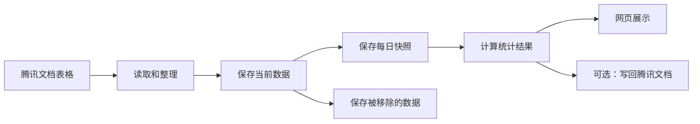

# 系统是怎么工作的

## 先说人话

这个系统主要做六件事：

1. 从腾讯文档读取表格。
2. 整理数据，并去掉重复项。
3. 保存当前数据。
4. 保存每日快照和被移除的数据。
5. 计算每天或一段时间内的统计结果。
6. 在网页上展示，也可以把汇总结果写回腾讯文档。



## 三个数据库分别放什么

| 数据库 | 通俗解释 |
|---|---|
| `OnlineData` | 当前正在使用的数据，以及用户、配置和同步记录 |
| `OnlineDataArchive` | 已经从腾讯文档移除的数据，留作历史查询 |
| `daily_report` | 每日快照、每日统计和总汇总 |

源码中还会看到四个数仓缩写：

- ODS：当前原始数据，主要在 `OnlineData`。
- DWD：每天保存一份数据快照。
- DWS：按核查人或社区整理出的每日报表。
- ADS：给页面展示的总汇总。

最重要的规则：查询多天数据时，要从每日快照重新计算，不能直接把每天的报表相加，否则同一条数据可能被重复计算。

数据库初始化由两个地方共同负责：

- `backend/init.sql`：新数据库第一次启动时建表。
- `backend/database.py`：后端启动时补充必要的表和兼容处理。

改数据库结构时，这两个地方都要检查。

## 网格员状态怎么计算

网格员有两层状态：

- `status`：长期状态。正常工作时是“在岗”，调离或长期不参与工作时是“离岗”。
- 请假日期：`leave_start_date` 到 `leave_end_date`。长期状态为“在岗”的人员，在这个日期范围内会自动按“离岗（请假）”处理，到期后自动恢复在岗。

请假原因保存在 `leave_reason`，来源保存在 `leave_source`。目前页面写入的来源是 `manual`，以后接入请假系统或工单系统时，可以沿用这些字段。

实际状态不只影响网格员页面，也会影响社区在岗人数、总汇总表和人均核查数。生成某一天的总汇总时按该日报日期判断；查询一段时间时按结束日期判断。

目前每名网格员只保存一个请假时间段。多次请假和外部系统对接的改造方向见 [未来计划](future-plans.md)。

## 日报日期必须有快照

日报只能使用对应日期的同步快照：

- 查询日期没有快照时，页面显示暂无数据。
- 生成某一天的日报时，如果当天没有快照，系统会拒绝生成。
- 不能拿当前在线数据代替过去日期的数据。

## 目前支持哪些业务表

| 业务类型 | 保存到哪里 | 能读取 | 能生成日报 |
|---|---|---:|---:|
| 全链条 | `t_fullchain` | 是 | 是 |
| 出租房屋核查 | `t_rental_check` | 是 | 是 |
| 涉警统计 | `t_police_stats` | 是 | 否 |
| 疑似未注销模型三 | `t_suspect_unrevoked` | 是 | 否 |
| 疑似返苏 | `t_suspect_return` | 是 | 是 |
| 寄递业 | `t_delivery_industry` | 是 | 是 |
| 群租房核查 | `t_group_rental` | 是 | 否 |

代码中的最终依据：

- 支持读取哪些表：`backend/services/parsers/__init__.py`。
- 支持生成哪些日报：`backend/services/report_builders/__init__.py`。

增加一种业务表时，不能只增加一个页面，还要一起检查数据库表、解析器、归档、查询、日报和前端选项。

## 后端主要文件

| 文件或目录 | 作用 |
|---|---|
| `backend/main.py` | 启动 FastAPI，并注册真正可用的接口 |
| `backend/services/sync_engine.py` | 负责完整的数据同步流程 |
| `backend/services/txdocs_client.py` | 负责读取和写入腾讯文档 |
| `backend/services/report_builders/` | 负责生成单日报表 |
| `backend/services/report_range.py` | 负责计算一段时间的统计 |

后端目前包括登录、表格配置、同步、统计、数据查询、网格员、系统设置、用户管理和健康检查。

`backend/routers/test_mock.py` 虽然存在，但没有在 `backend/main.py` 中启用，所以它现在不是可用接口。这个问题记录在 [风险清单](known-risks.md)。

## 前端主要文件

- 页面入口：`frontend/src/App.tsx`。
- 接口调用：`frontend/src/api/client.ts`。
- 登录状态：`frontend/src/context/`。
- 登录保护：`frontend/src/components/ProtectedRoute.tsx`。

前端构建结果放在 `frontend/dist/`，这个目录不会上传 Git。修改前端后要重新运行：

```powershell
Set-Location frontend
npm.cmd run build
```

## 当前生产环境要注意什么

仓库里同时存在 FastAPI 直接提供网页和 nginx 代理两种配置，但线上入口还没有完全整理一致。不要直接照搬旧部署计划，先看 [风险清单](known-risks.md)。

_源码核对：2026-07-26_
