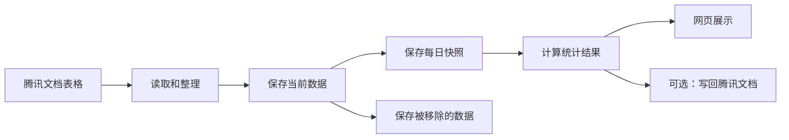
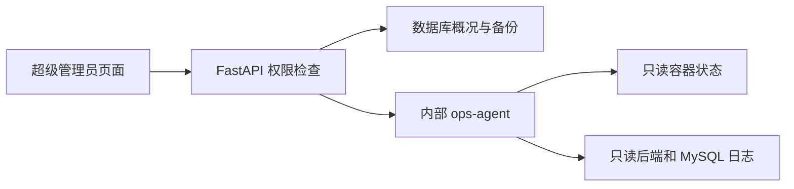

# 系统是怎么工作的

## 先说人话

这个系统目前有两种数据入口：

- 腾讯文档核查表格：同步后保存快照、归档和日报。
- 管理员上传的走访明细和星级评定 XLSX：校验、关联后保存，并按日期生成走访汇总。

腾讯文档这条数据流程主要做六件事：

1. 从腾讯文档读取表格。
2. 整理数据，并去掉重复项。
3. 保存当前数据。
4. 保存每日快照和被移除的数据。
5. 计算每天或一段时间内的统计结果。
6. 在网页上展示，也可以把汇总结果写回腾讯文档。



## 三个数据库分别放什么

| 数据库 | 通俗解释 |
|---|---|
| `OnlineData` | 当前正在使用的数据，以及用户、配置和同步记录 |
| `OnlineDataArchive` | 已经从腾讯文档移除的数据，留作历史查询 |
| `daily_report` | 每日快照、每日统计和总汇总 |

走访和星级评定数据保存在 `OnlineData`，不写入另外两个数据库：

| 表 | 用途 |
|---|---|
| `_visit_import_batches` | 保存每次导入的文件摘要、日期范围和处理数量 |
| `t_visit_details` | 唯一的走访业务表，同时保存走访明细和已经关联的星级评定字段 |
| `_visit_import_issues` | 保存本次导入的错误和提醒，页面读取时会再次遮盖敏感信息 |
| `_community_aliases` | 保存社区正式名称与来源数据别名的对应关系 |

源码中还会看到四个数仓缩写：

- ODS：当前原始数据，主要在 `OnlineData`。
- DWD：每天保存一份数据快照。
- DWS：按核查人或社区整理出的每日报表。
- ADS：给页面展示的总汇总。

最重要的规则：查询多天数据时，要从每日快照重新计算，不能直接把每天的报表相加，否则同一条数据可能被重复计算。

数据库初始化由两个地方共同负责：

- `backend/init.sql`：新数据库第一次启动时建表。
- `backend/database.py`：后端启动时补充必要的表和兼容处理。

改数据库结构时，这两个地方都要检查。

## 走访明细怎么导入

“走访汇总”支持分别上传走访明细和星级评定 XLSX。两份来源文件不会分别保存成两张业务表：
走访明细先写入 `t_visit_details`，星级评定匹配成功后直接补充在同一条走访记录上。

管理员上传文件后，浏览器只负责传文件，后端负责解析和入库：

1. 文件必须是 `.xlsx`，不超过 20MB。
2. 整个工作簿必须恰好有一个工作表包含完整的 11 个标准表头。
3. 地址、操作人和入户时间等关键字段错误时，该行跳过；其他正确行继续处理。
4. 社区名称会去掉末尾的“社区”或“村”。系统先匹配正式名称，再匹配社区管理中配置的别名；匹配成功后保存正式名称，原始“村社区”字段保持不变。
5. 空白的房间核查数量、新增、变更和注销按 0 处理，填写的值必须是非负整数。

网格员可以跨社区走访，因此操作人的所属社区和本次走访社区不同不算异常，也不会产生提醒。

去重使用“本地业务日期 + 标准化地址 + 网格员姓名”：

- 同一天、同一地址、同一网格员只保留一条，以入户时间更晚的记录为准。
- 同一天同一地址由不同网格员分别走访时，每名网格员各保留一条。
- 入户时间相同但内容不同，以最后上传的数据修正原记录。
- 较早记录会忽略，完全相同的记录记为“重复未变”。
- 相同地址出现在不同日期时，算作新的走访。
- 新文件与旧库日期重叠时只合并和更新，不删除文件中没有出现的旧记录。
- 文件内容还会计算 SHA-256；完全相同的文件再次上传时不会重新处理。

同一时间只允许一个走访文件入库，避免两个管理员同时上传时互相覆盖。服务意外重启后，
遗留的“导入中”批次会标记为失败，管理员可以重新上传原文件。

星级评定使用“标准化地址 + 时间”关联：

- 地址必须与走访明细标准化后的地址相同。
- 星级采集时间和入户时间相差不能超过前后 24 小时。
- 同一地址有多次走访时，选择时间差最小的一次。
- 如果两条走访的时间差完全相同，系统不会猜测属于哪位网格员，而是给出“匹配有歧义”提醒。
- 星级评定一定依附于走访；无法匹配的评定不会生成独立业务记录。
- 页面分别显示走访总数、已星级评定数和“仅走访未评定”数。

入户时间按系统时区理解，数据库保存 UTC 时间，并另外保存本地业务日期。页面的“当前数据库数据范围”
来自业务日期，显示最早和最晚日期、记录数、有数据日期、无数据日期以及最近一次成功导入时间。

走访汇总直接查询 `t_visit_details`，不另外生成日报表：

- 日期区间按走访记录的“业务日期”筛选，开始日期和结束日期都包含在内。
- 网格员汇总按“实际走访社区 + 操作人”分组，所以同一人跨社区走访时会分别显示。
- 社区汇总按实际走访社区分组，两张表的总计必须一致。
- 走访户数是一条去重后的走访记录算一户。
- 总变动数等于新增、变更和注销之和。
- 户均变动数等于总变动数除以走访户数，使用四舍五入保留 1 位小数。
- 星级评定数只计算已经成功关联的走访，星级评定率等于星级评定数除以走访户数。
- 表底总计会用合计后的数量重新计算户均变动数和星级评定率。

“操作人账号”按身份证号处理。姓名能匹配到现有网格员且该人员尚无身份证号时，系统自动补齐；
已有号码不同时不覆盖，只给出提醒。完整号码按已确认方案明文保存，但接口、页面、错误详情、
导出和日志不得返回完整号码。当前隐私风险记录在 [风险清单](known-risks.md)。

## 网格员状态怎么计算

网格员有两层状态：

- `status`：长期状态。正常工作时是“在岗”，调离或长期不参与工作时是“离岗”。
- 请假日期：`leave_start_date` 到 `leave_end_date`。长期状态为“在岗”的人员，在这个日期范围内会自动按“离岗（请假）”处理，到期后自动恢复在岗。

请假原因保存在 `leave_reason`，来源保存在 `leave_source`。目前页面写入的来源是 `manual`，以后接入请假系统或工单系统时，可以沿用这些字段。

实际状态不只影响网格员页面，也会影响社区在岗人数、总汇总表和人均核查数。生成某一天的总汇总时按该日报日期判断；查询一段时间时按结束日期判断。

核查人明细以“网格员管理”中的名单为人员基准。指定日期实际在岗、但没有任何统计数据的人也会显示，所有统计数字均为 0；长期离岗或当天请假的人员不补零。单日报表按日报日期判断，区间报表按结束日期判断。旧日报在读取时使用当前名册补全，所以名册发生变化后，旧日报中补出的零数据人员也可能变化。

目前每名网格员只保存一个请假时间段。多次请假和外部系统对接的改造方向见 [未来计划](future-plans.md)。

## 日报日期必须有快照

日报只能使用对应日期的同步快照：

- 查询日期没有快照时，页面显示暂无数据。
- 生成某一天的日报时，如果当天没有快照，系统会拒绝生成。
- 不能拿当前在线数据代替过去日期的数据。

系统按“系统设置”里的时区判断今天，默认使用上海时区。数据库时间仍按 UTC
保存，统计时会自动换算日期范围。这样在北京时间凌晨同步，也不会被记到前一天。

## 统计数字和天数是什么关系

单日和多日现在不是同一种算法：

- 查一天时，统计的是当天新增或发生变化的工作量。
- 查多天时，系统会把这段时间的快照合在一起，同一条数据只保留最后状态，然后统计区间结束时的结果。

单日工作量中，新入库的数据按首次入库时的当前状态归类：地址和结果都未填写是“未核查”，
只填写地址是“已核查”，填写了核查结果就是“已完成”。因此，从在线表格第一次同步进来时
就已经填写“已登记”或“无法核实”的数据，也会进入“已完成”，不会只计入数据总数。
已经存在的数据仍按当天的状态变化统计。

“无法见底数”只统计核查结果为“无法核实”的数据，不能把还未核查的数据算进去。
“核查见底率”按“（已完成 − 无法见底数）÷ 数据总数”计算，因此未核查数据不会增加
无法见底数，但仍会降低核查见底率。

“疑似未注销模型三”没有“现住址”这一中间字段，所以使用单独规则：核查结果为空是
“未核查”，“近期反吴”“在吴”“离吴”任意一种都是“已完成”，“已核查”固定为 0。
这三种结果都表示已经见底，社区使用原表中的“下发社区”。模型三没有“无法核实”这个结果，
所以它的无法见底数固定为 0。

汇总表有两种显示方式，但数据库和日报始终保存完整的三列结果：

- 三列模式：显示“未核查、已核查、已完成”。
- 两列模式：把原来的“未核查”和“已核查”相加后显示为“未核查”，把原来的“已完成”
  显示为“已核查”。

两列模式只改变网页和导出时的展示，不会改写日报或历史数据。“核查完成率”等于两列模式中的
“已核查 ÷ 数据总数”，所以数值与三列模式的“已完成 ÷ 数据总数”相同。转换逻辑统一放在
后端，网页和以后增加的 XLSX 导出都要调用同一套规则，不能各自计算一遍。

表格/卡片模式和两列/三列模式都保存在当前用户账号中，同一账号换电脑登录后仍保持一致。

每张核查人明细、社区汇总和总汇总的底部都有一行“总计”。数量字段直接相加；
核查完成率、核查见底率和当日人均核查数使用合计后的数量重新计算，不能把每行的百分比或
人均值直接相加。总计与普通数据分开返回，所以不会参加表头排序和筛选，后续 XLSX 导出也应
复用同一份后端总计结果。

一次同步会先读完全部已启用表格，并保存本轮成功业务的最新快照。数据阶段结束后，系统再逐张
生成本轮成功且支持日报的分汇总表。只有数据和分汇总表全部成功时，才最后更新总汇总表。
如果其中一张表失败，已经成功的分汇总表会保留，但总汇总表不会被新结果覆盖，避免出现缺少
部分业务数据的总表。

在页面上手动生成总汇总表时，系统会按照“总汇总表配置”中选中的业务类型，先逐张重新
生成对应日期的分汇总表，再生成总汇总表。如果其中一张分表没有当天快照或生成失败，
本次总汇总会停止，并提示具体是哪一种业务，避免生成一个缺少部分业务数据的总表。

目前页面显示的区间天数只用于提示，没有拿来做除法。这个天数是“找到快照的天数”，
不一定等于开始日期到结束日期之间的自然天数。例如选择 7 天但只有 5 天同步过，页面
记录的天数就是 5。

区间查询还有一个需要注意的口径：目前只纳入“首次入库时间落在所选区间内”的数据。
一条数据如果更早就已经入库，只是在所选区间内完成核查，当前区间统计不会把它算进去。

| 指标 | 当前算法 | 是否除以天数 |
|---|---|---:|
| 数据总数、未核查、已核查、已完成、无法见底数 | 区间内去重后的数量 | 否 |
| 核查完成率 | 已完成 ÷ 数据总数 | 否 |
| 核查见底率 |（已完成 − 无法见底数）÷ 数据总数 | 否 |
| 网格员人数 | 按区间结束日期计算在岗人数 | 否 |
| 当日人均核查数 | 已完成 ÷ 在岗网格员人数 | 否 |

所以“当日人均核查数”只在查一天时名副其实。查询多天时，它目前实际表示“这段时间每名在岗网格员完成多少条”，没有再除以天数。

如果区间内每天在岗人数都相同，可以用下面的简化算法计算“日均人均核查数”：

```text
已完成 ÷ 在岗网格员人数 ÷ 区间天数
```

如果区间内有人请假、离岗或恢复在岗，更准确的算法是：

```text
已完成 ÷ 在岗人天
```

“在岗人天”就是把每天实际在岗的人数相加。例如第一天 10 人、第二天 9 人，
两天合计就是 19 个在岗人天。当前系统没有保存完整的历史人员名册，只保存现有人员
和一个请假区间，因此还不能保证所有历史日期都能准确还原在岗人天。

是否替换原指标，还是同时保留“区间人均”和“日均人均”，需要由项目管理人确认后再改。
确认时还要一起决定：

- 除以日期范围的自然天数，还是实际有同步快照的天数。
- 统计区间内新入库的数据，还是区间内实际完成的工作。

## 目前支持哪些业务表

| 业务类型 | 保存到哪里 | 能读取 | 能生成日报 |
|---|---|---:|---:|
| 全链条 | `t_fullchain` | 是 | 是 |
| 出租房屋核查 | `t_rental_check` | 是 | 是 |
| 涉警统计 | `t_police_stats` | 是 | 否 |
| 疑似未注销模型三 | `t_suspect_unrevoked` | 是 | 是 |
| 疑似返苏 | `t_suspect_return` | 是 | 是 |
| 寄递业 | `t_delivery_industry` | 是 | 是 |
| 群租房核查 | `t_group_rental` | 是 | 否 |

代码中的最终依据：

- 支持读取哪些表：`backend/services/parsers/__init__.py`。
- 支持生成哪些日报：`backend/services/report_builders/__init__.py`。

增加一种业务表时，不能只增加一个页面，还要一起检查数据库表、解析器、归档、查询、日报和前端选项。

疑似返苏在代码和新建数据库中使用“身份证号码”“二次核查结果”作为标准列名。旧部署的归档表
可能仍使用“身份证号”“二次反馈”，同步和查询会自动识别这组旧列名。旧归档表的“联系号码”
还需要按受控迁移文件扩到 500 个字符；迁移必须在三库备份后单独执行。

## 入库主键和重复数据

- 全链条使用“身份证号 + 电话号码 + 下发日期”识别一条记录。同一人员在不同下发批次中会分别保存。
- 涉警统计使用“序号 + 日期 + 社区 + 简要警情及处理结果”识别一条记录。生产环境目前关闭了
  涉警统计同步；重新启用前仍建议在腾讯文档增加永久不变的记录编号。
- 只有所有业务字段都完全相同的行才会自动去重。主键相同但内容不同时，该业务表会停止同步并
  明确报错，不再用最后一行静默覆盖前面的数据。
- 旧主键切换到新主键时，使用 `backend/migrations/rekey_collision_tables.py` 先演练再迁移。
  迁移只补当前在线数据，不改写历史日报。

## 后端主要文件

| 文件或目录 | 作用 |
|---|---|
| `backend/main.py` | 启动 FastAPI，并注册真正可用的接口 |
| `backend/services/sync_engine.py` | 负责完整的数据同步流程 |
| `backend/services/sync_tasks.py` | 创建手动或自动同步任务，重排下次执行时间 |
| `backend/services/sync_scheduler.py` | 每隔几秒检查一次是否到达自动同步时间 |
| `backend/services/txdocs_client.py` | 负责读取和写入腾讯文档 |
| `backend/services/report_builders/` | 负责生成单日报表 |
| `backend/services/report_range.py` | 负责计算一段时间的统计 |
| `backend/services/report_view.py` | 统一转换汇总表的两列或三列输出 |
| `backend/services/visit_import.py` | 校验、去重并导入走访明细，计算已有数据范围 |
| `backend/services/star_rating_import.py` | 校验星级评定并在 24 小时内关联走访记录 |
| `backend/services/visit_summary.py` | 按日期区间计算网格员和社区走访汇总 |
| `backend/routers/visits.py` | 提供走访范围、导入和问题明细接口 |

后端目前包括登录、表格配置、同步、统计、数据查询、走访明细导入、网格员、系统设置、用户管理、站内通知和健康检查。

## 超级管理员运维中心

运维中心只给超级管理员使用。它用于看状态和创建备份，不是网页终端。

它分成两部分：

- 主后端负责权限、数据库概况、备份、审计和页面接口。
- `ops-agent` 只负责读取 Docker 中两个白名单容器的状态和日志。只有这个内部容器可以访问 Docker Socket，它没有公网端口，也没有执行命令、重启或删除接口。



运维数据保存在 `OnlineData`：

| 表 | 用途 |
|---|---|
| `_backup_schedule` | 保存每日备份时间，默认按系统时区凌晨 2 点执行 |
| `_backup_jobs` | 保存备份任务状态、文件名、大小、SHA-256 和错误信息 |
| `_admin_audit_log` | 保存超管重要操作，不保存密码、令牌、Cookie 或请求正文 |

备份使用 MySQL 客户端直接导出三个数据库，不通过 Docker Socket。流程是：

1. 先写临时 SQL 文件。
2. 压缩成临时 gzip 文件。
3. 检查命令结果、文件大小、gzip 能否完整读取和必要的数据库标记。
4. 计算最终 gzip 文件的 SHA-256。
5. 全部通过后，才改成正式文件名。

平台创建的自动和手动备份都保存 7 天，并始终保留最近一份成功备份。旧版本留下的备份只展示，不自动清理。恢复和删除都不在网页中提供。

## 定时同步和同步状态

定时同步默认开启，初始间隔是 5 分钟。系统没有引入额外的定时任务组件，而是在后端进程中每隔
5 秒检查一次数据库里的下次执行时间。真正创建任务前会使用数据库锁，因此同一时刻只会有一个
等待中或运行中的同步任务。

相关数据保存在 `OnlineData`：

| 表 | 用途 |
|---|---|
| `_sync_schedule` | 保存是否开启、间隔、下次执行时间和最后触发时间；固定只有一行 |
| `_sync_log` | 保存手动或自动来源、当前阶段、当前业务、真实步骤和错误信息 |
| `_notifications` | 按超级管理员分别保存自动同步失败通知和已读状态 |

手动同步和自动同步使用同一套数据与报表流程。任务无论成功、部分失败还是失败，都会从结束时刻
重新等待一个完整间隔。后端重启时，遗留的等待中或运行中任务会被标记为失败；如果它原本是自动
任务，还会向每名超级管理员各写入一条站内通知。

权限规则：

- 超级管理员可以修改定时同步设置，也可以手动同步。
- 管理员可以手动同步，但不能修改定时设置。
- 组长和组员只能查看同步状态与下一次倒计时。
- 站内通知目前只向超级管理员显示，只通知自动同步的失败和部分失败。

`backend/routers/test_mock.py` 虽然存在，但没有在 `backend/main.py` 中启用，所以它现在不是可用接口。这个问题记录在 [风险清单](known-risks.md)。

## 前端主要文件

- 页面入口：`frontend/src/App.tsx`。
- 接口调用：`frontend/src/api/client.ts`。
- 登录状态：`frontend/src/context/`。
- 登录保护：`frontend/src/components/ProtectedRoute.tsx`。
- 统一表格：`frontend/src/components/AppTable.tsx`。汇总、原始数据和管理页面都使用 Ant Design Table；手机端原有卡片模式继续保留。
- 走访汇总页面：`frontend/src/pages/VisitSummary.tsx`。按日期查看网格员和社区汇总，并列上传走访明细和星级评定，显示数据范围、上传结果和导入问题。

前端构建结果放在 `frontend/dist/`，这个目录不会上传 Git。修改前端后要重新运行：

```powershell
Set-Location frontend
npm.cmd run build
```

## 当前生产环境要注意什么

生产服务器已在 2026-07-28 完成安全入口和运维中心上线：

- MySQL 不发布宿主机端口，只允许 Compose 内部服务访问。
- 后端只绑定宿主机回环地址，由 nginx 对外提供 HTTPS。
- 浏览器会话 Cookie 在生产环境启用 `Secure`，CORS 只接受明确配置的来源。
- `ops-agent` 只在 Compose 内部提供服务，没有公网端口。
- 新数据库不再使用写死的超级管理员密码。现有生产环境不设置初始化账号或密码。

当前服务器的 HTTP 80 还属于另一套独立应用，滨湖平台使用 HTTPS 443。页面和静态资源
也通过本机后端代理，nginx 不需要读取 `/root` 下的文件。

OAuth 凭据加密和异地备份仍未完成，具体见 [风险清单](known-risks.md)。

_源码核对：2026-07-28_
