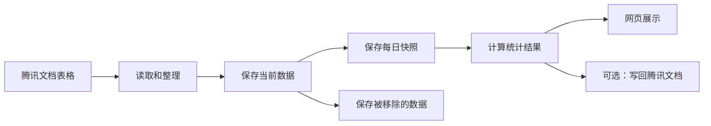

# 系统是怎么工作的

## 先说人话

这个系统主要做六件事：

1. 从腾讯文档读取表格。
2. 整理数据，并去掉重复项。
3. 保存当前数据。
4. 保存每日快照和被移除的数据。
5. 计算每天或一段时间内的统计结果。
6. 在网页上展示，也可以把汇总结果写回腾讯文档。



## 三个数据库分别放什么

| 数据库 | 通俗解释 |
|---|---|
| `OnlineData` | 当前正在使用的数据，以及用户、配置和同步记录 |
| `OnlineDataArchive` | 已经从腾讯文档移除的数据，留作历史查询 |
| `daily_report` | 每日快照、每日统计和总汇总 |

源码中还会看到四个数仓缩写：

- ODS：当前原始数据，主要在 `OnlineData`。
- DWD：每天保存一份数据快照。
- DWS：按核查人或社区整理出的每日报表。
- ADS：给页面展示的总汇总。

最重要的规则：查询多天数据时，要从每日快照重新计算，不能直接把每天的报表相加，否则同一条数据可能被重复计算。

数据库初始化由两个地方共同负责：

- `backend/init.sql`：新数据库第一次启动时建表。
- `backend/database.py`：后端启动时补充必要的表和兼容处理。

改数据库结构时，这两个地方都要检查。

## 网格员状态怎么计算

网格员有两层状态：

- `status`：长期状态。正常工作时是“在岗”，调离或长期不参与工作时是“离岗”。
- 请假日期：`leave_start_date` 到 `leave_end_date`。长期状态为“在岗”的人员，在这个日期范围内会自动按“离岗（请假）”处理，到期后自动恢复在岗。

请假原因保存在 `leave_reason`，来源保存在 `leave_source`。目前页面写入的来源是 `manual`，以后接入请假系统或工单系统时，可以沿用这些字段。

实际状态不只影响网格员页面，也会影响社区在岗人数、总汇总表和人均核查数。生成某一天的总汇总时按该日报日期判断；查询一段时间时按结束日期判断。

核查人明细以“网格员管理”中的名单为人员基准。指定日期实际在岗、但没有任何统计数据的人也会显示，所有统计数字均为 0；长期离岗或当天请假的人员不补零。单日报表按日报日期判断，区间报表按结束日期判断。旧日报在读取时使用当前名册补全，所以名册发生变化后，旧日报中补出的零数据人员也可能变化。

目前每名网格员只保存一个请假时间段。多次请假和外部系统对接的改造方向见 [未来计划](future-plans.md)。

## 日报日期必须有快照

日报只能使用对应日期的同步快照：

- 查询日期没有快照时，页面显示暂无数据。
- 生成某一天的日报时，如果当天没有快照，系统会拒绝生成。
- 不能拿当前在线数据代替过去日期的数据。

系统按“系统设置”里的时区判断今天，默认使用上海时区。数据库时间仍按 UTC
保存，统计时会自动换算日期范围。这样在北京时间凌晨同步，也不会被记到前一天。

## 统计数字和天数是什么关系

单日和多日现在不是同一种算法：

- 查一天时，统计的是当天新增或发生变化的工作量。
- 查多天时，系统会把这段时间的快照合在一起，同一条数据只保留最后状态，然后统计区间结束时的结果。

单日工作量中，新入库的数据按首次入库时的当前状态归类：地址和结果都未填写是“未核查”，
只填写地址是“已核查”，填写了核查结果就是“已完成”。因此，从在线表格第一次同步进来时
就已经填写“已登记”或“无法核实”的数据，也会进入“已完成”，不会只计入数据总数。
已经存在的数据仍按当天的状态变化统计。

“疑似未注销模型三”没有“现住址”这一中间字段，所以使用单独规则：核查结果为空是
“未核查”，“近期反吴”“在吴”“离吴”任意一种都是“已完成”，“已核查”固定为 0。
这三种结果都表示已经见底，社区使用原表中的“下发社区”。

成功同步一张支持日报的业务表后，系统会立即用最新快照刷新当天分表日报。全部业务表同步
结束后，再刷新当天总汇总表，避免页面继续显示同步前的旧日报。

在页面上手动生成总汇总表时，系统会按照“总汇总表配置”中选中的业务类型，先逐张重新
生成对应日期的分汇总表，再生成总汇总表。如果其中一张分表没有当天快照或生成失败，
本次总汇总会停止，并提示具体是哪一种业务，避免生成一个缺少部分业务数据的总表。

目前页面显示的区间天数只用于提示，没有拿来做除法。这个天数是“找到快照的天数”，
不一定等于开始日期到结束日期之间的自然天数。例如选择 7 天但只有 5 天同步过，页面
记录的天数就是 5。

区间查询还有一个需要注意的口径：目前只纳入“首次入库时间落在所选区间内”的数据。
一条数据如果更早就已经入库，只是在所选区间内完成核查，当前区间统计不会把它算进去。

| 指标 | 当前算法 | 是否除以天数 |
|---|---|---:|
| 数据总数、未核查、已核查、已完成、无法见底数 | 区间内去重后的数量 | 否 |
| 核查完成率 | 已完成 ÷ 数据总数 | 否 |
| 核查见底率 | 可以见底的数据数 ÷ 数据总数 | 否 |
| 网格员人数 | 按区间结束日期计算在岗人数 | 否 |
| 当日人均核查数 | 已完成 ÷ 在岗网格员人数 | 否 |

所以“当日人均核查数”只在查一天时名副其实。查询多天时，它目前实际表示“这段时间每名在岗网格员完成多少条”，没有再除以天数。

如果区间内每天在岗人数都相同，可以用下面的简化算法计算“日均人均核查数”：

```text
已完成 ÷ 在岗网格员人数 ÷ 区间天数
```

如果区间内有人请假、离岗或恢复在岗，更准确的算法是：

```text
已完成 ÷ 在岗人天
```

“在岗人天”就是把每天实际在岗的人数相加。例如第一天 10 人、第二天 9 人，
两天合计就是 19 个在岗人天。当前系统没有保存完整的历史人员名册，只保存现有人员
和一个请假区间，因此还不能保证所有历史日期都能准确还原在岗人天。

是否替换原指标，还是同时保留“区间人均”和“日均人均”，需要由项目管理人确认后再改。
确认时还要一起决定：

- 除以日期范围的自然天数，还是实际有同步快照的天数。
- 统计区间内新入库的数据，还是区间内实际完成的工作。

## 目前支持哪些业务表

| 业务类型 | 保存到哪里 | 能读取 | 能生成日报 |
|---|---|---:|---:|
| 全链条 | `t_fullchain` | 是 | 是 |
| 出租房屋核查 | `t_rental_check` | 是 | 是 |
| 涉警统计 | `t_police_stats` | 是 | 否 |
| 疑似未注销模型三 | `t_suspect_unrevoked` | 是 | 是 |
| 疑似返苏 | `t_suspect_return` | 是 | 是 |
| 寄递业 | `t_delivery_industry` | 是 | 是 |
| 群租房核查 | `t_group_rental` | 是 | 否 |

代码中的最终依据：

- 支持读取哪些表：`backend/services/parsers/__init__.py`。
- 支持生成哪些日报：`backend/services/report_builders/__init__.py`。

增加一种业务表时，不能只增加一个页面，还要一起检查数据库表、解析器、归档、查询、日报和前端选项。

疑似返苏在代码和新建数据库中使用“身份证号码”“二次核查结果”作为标准列名。旧部署的归档表
可能仍使用“身份证号”“二次反馈”，同步和查询会自动识别这组旧列名。旧归档表的“联系号码”
还需要按受控迁移文件扩到 500 个字符；迁移必须在三库备份后单独执行。

## 入库主键和重复数据

- 全链条使用“身份证号 + 电话号码 + 下发日期”识别一条记录。同一人员在不同下发批次中会分别保存。
- 涉警统计使用“序号 + 日期 + 社区 + 简要警情及处理结果”识别一条记录。生产环境目前关闭了
  涉警统计同步；重新启用前仍建议在腾讯文档增加永久不变的记录编号。
- 只有所有业务字段都完全相同的行才会自动去重。主键相同但内容不同时，该业务表会停止同步并
  明确报错，不再用最后一行静默覆盖前面的数据。
- 旧主键切换到新主键时，使用 `backend/migrations/rekey_collision_tables.py` 先演练再迁移。
  迁移只补当前在线数据，不改写历史日报。

## 后端主要文件

| 文件或目录 | 作用 |
|---|---|
| `backend/main.py` | 启动 FastAPI，并注册真正可用的接口 |
| `backend/services/sync_engine.py` | 负责完整的数据同步流程 |
| `backend/services/txdocs_client.py` | 负责读取和写入腾讯文档 |
| `backend/services/report_builders/` | 负责生成单日报表 |
| `backend/services/report_range.py` | 负责计算一段时间的统计 |

后端目前包括登录、表格配置、同步、统计、数据查询、网格员、系统设置、用户管理和健康检查。

`backend/routers/test_mock.py` 虽然存在，但没有在 `backend/main.py` 中启用，所以它现在不是可用接口。这个问题记录在 [风险清单](known-risks.md)。

## 前端主要文件

- 页面入口：`frontend/src/App.tsx`。
- 接口调用：`frontend/src/api/client.ts`。
- 登录状态：`frontend/src/context/`。
- 登录保护：`frontend/src/components/ProtectedRoute.tsx`。
- 统一表格：`frontend/src/components/AppTable.tsx`。汇总、原始数据和管理页面都使用 Ant Design Table；手机端原有卡片模式继续保留。

前端构建结果放在 `frontend/dist/`，这个目录不会上传 Git。修改前端后要重新运行：

```powershell
Set-Location frontend
npm.cmd run build
```

## 当前生产环境要注意什么

仓库里同时存在 FastAPI 直接提供网页和 nginx 代理两种配置，但线上入口还没有完全整理一致。不要直接照搬旧部署计划，先看 [风险清单](known-risks.md)。

_源码核对：2026-07-27_
